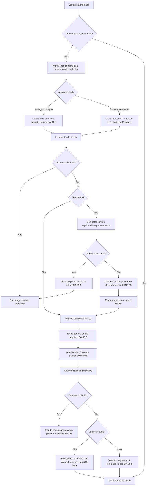
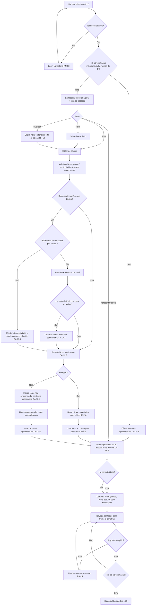

# PRD-TECNICO.md — App de Leitura Bíblica Guiada + Preparo de Estudo

- **Versão**: rascunho rodada 2 (Loop A do `/planejar`)
- **Data**: 2026-09-07
- **Autor**: gestor (chapéu Business Analyst)
- **Base**: `.md/PRD.md` (rodada 2) e `.md/CTO-REVIEW.md` → Gate 1 + adendo de rodada 2
- **Consumidor primário**: `coordenador` (chapéus Software Architect e UX/UI)

> Este documento **não toma decisão de arquitetura**. Onde há restrição técnica
> declarada, ela vem de restrição de produto ou de obrigação legal — a escolha de
> mecanismo, stack, schema e contrato é do Coordenador.
>
> Convenção de critério de aceite: **EARS** (Easy Approach to Requirements Syntax).
> Padrões usados: *Ubíquo* ("O sistema deve…"), *Evento* ("Quando X, o sistema
> deve…"), *Estado* ("Enquanto X, o sistema deve…"), *Opcional* ("Onde X existir, o
> sistema deve…"), *Indesejado* ("Se X, então o sistema deve…").
>
> **Mudanças da rodada 2**: RF-07 (áudio) removido; RF-19 e RF-20 adicionados; RF-04,
> RF-05, RF-06, RF-08, RF-13, RF-14, RF-16 e RF-18 alterados; RN-02 e RN-04
> reescritas; RN-13 e RN-14 adicionadas; E-02 removida. Detalhe em §7.

---

## 1. Requisitos Funcionais

Rastreabilidade: coluna "Origem" aponta o requisito de alto nível do `PRD.md` §5.
Fase conforme `PRD.md` §4.1.

### Fase 1 — Módulo 1 e fundação

---

#### RF-01 — Leitura do texto bíblico

**Origem**: RA-01, RA-04 · **Fase**: 1 · **Prioridade**: Must

O usuário navega livremente pelo corpus bíblico completo, sem conta.

Critérios de aceite:
- CA-01.1 (Ubíquo) O sistema deve disponibilizar os 66 livros do corpus BLIVRE (39 do
  Antigo Testamento e 27 do Novo Testamento), navegáveis por livro e por capítulo.
- CA-01.2 (Evento) Quando o usuário selecionar um livro e um capítulo, o sistema deve
  exibir o texto integral daquele capítulo com os números de versículo visíveis.
- CA-01.3 (Evento) Quando o usuário abrir qualquer tela que exiba texto bíblico, o
  sistema deve exibir a atribuição exigida pela licença conforme RN-06, acessível a
  no máximo um toque a partir daquela tela.
- CA-01.4 (Indesejado) Se um capítulo solicitado não existir no corpus, então o
  sistema deve informar que a referência é inválida e manter o usuário na navegação,
  sem tela de erro genérica.
- CA-01.5 (Ubíquo) O sistema deve exibir o nome da tradução como "Bíblia Livre
  (BLIVRE)" e nunca como "Almeida Atualizada", "ARA" ou "ARC" (ressalva R-02 do
  Gate 1).
- **CA-01.6** (Opcional) *[rodada 2]* Onde o trecho exibido na leitura livre estiver
  coberto por uma Nota de Perícope (RN-13), o sistema deve oferecer a nota na mesma
  tela, com o mesmo tratamento visual de RF-06 — sem exigir conta.

---

#### RF-02 — Plano Entrelaçado de 90 dias

**Origem**: RA-03 · **Fase**: 1 · **Prioridade**: Must

Critérios de aceite:
- CA-02.1 (Ubíquo) O sistema deve conter exatamente 90 dias de plano, cada dia com uma
  porção do Antigo Testamento e uma do Novo Testamento, conforme RN-01.
- CA-02.2 (Evento) Quando o usuário abrir o dia corrente do plano, o sistema deve
  exibir, na mesma tela: a porção do AT, a porção do NT, a Nota de Perícope associada
  (RF-06), o gancho de continuidade (RN-04) e o número do dia dentro dos 90.
- CA-02.3 (Ubíquo) O sistema deve exibir cada porção como um intervalo contínuo e
  identificado (livro, capítulo e versículo inicial e final), nunca como texto solto
  sem referência.
- CA-02.4 (Estado) Enquanto o usuário não tiver iniciado o plano, o sistema deve
  permitir a visualização do dia 1 completo, incluindo a nota, sem exigir conta
  (RN-03).
- CA-02.5 (Indesejado) Se a definição do plano violar qualquer restrição de RN-01 ou a
  regra de cobertura de RN-13, então o sistema deve falhar a validação de conteúdo na
  carga e não publicar o plano.

---

#### RF-03 — Marcar dia como concluído e acompanhar progresso

**Origem**: RA-05 · **Fase**: 1 · **Prioridade**: Must

Critérios de aceite:
- CA-03.1 (Evento) Quando o usuário acionar "concluir dia", o sistema deve registrar o
  dia do plano como concluído, com data e hora no fuso `America/Sao_Paulo`.
- CA-03.2 (Evento) Quando um dia for concluído, o sistema deve avançar o "dia corrente"
  do plano para o menor dia ainda não concluído, conforme RN-09.
- CA-03.3 (Ubíquo) O sistema deve exibir o progresso como "N de 90 dias concluídos".
- CA-03.4 (Evento) Quando um usuário sem conta acionar "concluir dia", o sistema deve
  registrar o progresso localmente e acionar o soft gate conforme RN-03.
- CA-03.5 (Indesejado) Se o usuário acionar "concluir dia" num dia já concluído, então
  o sistema deve manter o registro original e não duplicar a conclusão.
- **CA-03.6** (Evento) *[rodada 2]* Quando o usuário concluir um dia, o sistema deve
  exibir o gancho de continuidade daquele dia (RN-04) antes de qualquer outro elemento
  de encerramento da sessão.

---

#### RF-04 — Indicador de constância

**Origem**: RA-08 · **Fase**: 1 · **Prioridade**: Should
*[reescrito na rodada 2 — antes era "Streak"; ver `PRD.md` §4.6 e RN-02]*

Critérios de aceite:
- CA-04.1 (Ubíquo) O sistema deve exibir, como indicador principal de constância,
  **"dias lidos nos últimos 30"**, calculado conforme RN-02.
- CA-04.2 (Ubíquo) O sistema deve calcular e exibir a sequência consecutiva (streak)
  apenas como informação secundária, e o recorde histórico dessa sequência.
- CA-04.3 (Indesejado) Se a sequência consecutiva do usuário for interrompida, então o
  sistema **não deve** enviar notificação, exibir alerta, animação de perda ou
  qualquer mensagem sobre a interrupção.
- CA-04.4 (Evento) Quando o usuário concluir um dia do plano num dia-calendário em que
  ainda não havia concluído nenhum, o sistema deve atualizar o indicador de
  constância.
- CA-04.5 (Ubíquo) O sistema não deve oferecer medalhas, níveis, pontos ou qualquer
  outro elemento de gamificação (F-17 do `PRD.md`).

---

#### RF-05 — Lembrete diário com gancho

**Origem**: RA-09 · **Fase**: 1 · **Prioridade**: **Must** *(era Should na rodada 1)*

Critérios de aceite:
- CA-05.1 (Evento) Quando o usuário ativar o lembrete, o sistema deve solicitar o
  horário desejado e persistir a preferência associada à conta.
- CA-05.2 (Estado) Enquanto o lembrete estiver ativo e o dia corrente do plano não
  tiver sido concluído, o sistema deve enviar uma notificação no horário configurado.
- **CA-05.3** (Ubíquo) *[rodada 2]* O corpo da notificação deve ser o **gancho de
  continuidade do dia corrente** (RN-04), e nunca uma frase genérica de lembrete.
- CA-05.4 (Indesejado) Se o dia corrente já tiver sido concluído no horário do
  lembrete, então o sistema não deve enviar notificação naquele dia.
- CA-05.5 (Indesejado) Se o canal de notificação não estiver disponível no
  navegador/dispositivo (ver P-08 do `PRD.md`), então o sistema deve informar isso
  explicitamente no momento da ativação, oferecer o canal alternativo disponível e —
  em qualquer caso — exibir o gancho na retomada in-app, de modo que a alavanca de
  continuidade nunca dependa exclusivamente de push.
- CA-05.6 (Ubíquo) O sistema deve permitir desativar o lembrete a qualquer momento, em
  no máximo dois toques a partir da tela de configurações.
- CA-05.7 (Ubíquo) O sistema deve registrar envio e desfecho de cada lembrete para
  apuração da métrica M-08.

---

#### RF-06 — Nota de Perícope

**Origem**: RA-04 · **Fase**: 1 · **Prioridade**: Must
*[reescrito na rodada 2 — antes era "Nota do Dia", ancorada ao dia do plano]*

Critérios de aceite:
- CA-06.1 (Ubíquo) O sistema deve armazenar cada nota ancorada a uma **perícope**
  (intervalo de texto), não a um dia do plano, conforme RN-13.
- CA-06.2 (Ubíquo) O sistema deve garantir que todo dia do plano tenha pelo menos uma
  Nota de Perícope associada, conforme a regra de cobertura de RN-13.
- CA-06.3 (Ubíquo) O sistema deve exibir a nota com 120 a 200 palavras, visualmente
  distinta do texto bíblico, de modo que o usuário nunca confunda nota com Escritura.
- **CA-06.4** (Ubíquo) *[rodada 2]* O sistema deve exibir, junto de cada nota, o nome
  de quem a escreveu e, quando houver, o nome de quem a revisou.
- CA-06.5 (Evento) Quando a porção do AT do dia estiver classificada como
  `legal-ritual`, `genealogico` ou `profetico` (RN-01), o sistema deve exibir uma nota
  que atenda à RN-04 (responder explicitamente "por que este texto está aqui").
- CA-06.6 (Indesejado) Se algum dia do plano não tiver nota associada, então o sistema
  deve falhar a validação de conteúdo na carga e não publicar o plano.
- CA-06.7 (Ubíquo) O sistema deve exibir a nota sem exigir conta.

---

#### RF-08 — Vitrine sem login

**Origem**: RA-10 · **Fase**: 1 · **Prioridade**: Should

Critérios de aceite:
- **CA-08.1** (Evento) *[alterado na rodada 2]* Quando um visitante sem conta abrir a
  tela inicial, o sistema deve exibir, como elemento principal, uma prévia do dia do
  plano **com a Nota de Perícope**, além do versículo do dia e de uma chamada de ação
  ("Continue lendo" / "Comece seu plano").
- CA-08.2 (Ubíquo) O sistema não deve exibir anúncio de terceiros em nenhuma tela.
- CA-08.3 (Ubíquo) O sistema deve selecionar o versículo do dia de forma determinística
  a partir da data corrente, de modo que todos os visitantes vejam o mesmo versículo no
  mesmo dia.
- CA-08.4 (Indesejado) Se a tela inicial for aberta sem rede e o conteúdo não estiver
  disponível localmente, então o sistema deve exibir a entrada do plano em vez de uma
  tela vazia ou de erro.

---

#### RF-09 — Soft gate de login

**Origem**: RA-06 · **Fase**: 1 · **Prioridade**: Must

Critérios de aceite:
- CA-09.1 (Estado) Enquanto o visitante não tiver conta, o sistema deve permitir
  navegar pelo corpus, abrir qualquer dia do plano e ler as notas.
- CA-09.2 (Evento) Quando o visitante sem conta acionar uma das três ações de RN-03, o
  sistema deve apresentar o convite de criação de conta explicando o que será salvo.
- CA-09.3 (Evento) Quando o visitante recusar a criação de conta, o sistema deve
  devolvê-lo ao ponto exato em que estava, sem perder a leitura em curso.
- CA-09.4 (Indesejado) Se o visitante sem conta tentar abrir o Módulo 2, então o
  sistema deve exigir conta antes de qualquer acesso, sem exceção (RN-03).
- CA-09.5 (Ubíquo) O sistema deve registrar o resultado de cada acionamento do soft
  gate (aceito/recusado) para apuração da métrica M-06.

---

#### RF-10 — Conta de usuário

**Origem**: RA-06, RA-07 · **Fase**: 1 · **Prioridade**: Must

Critérios de aceite:
- CA-10.1 (Ubíquo) O sistema deve permitir criar conta, entrar, sair e recuperar
  acesso.
- CA-10.2 (Evento) Quando o usuário criar conta, o sistema deve solicitar
  consentimento específico e destacado para o tratamento de dados que revelam
  convicção religiosa, conforme RNF-05, antes de persistir qualquer dado pessoal no
  servidor.
- CA-10.3 (Evento) Quando o usuário solicitar a exclusão da conta, o sistema deve
  eliminar seus dados pessoais e conteúdo (progresso, constância, esboços) conforme
  RN-11.
- CA-10.4 (Evento) Quando o usuário solicitar seus dados, o sistema deve fornecer
  exportação em formato legível por máquina, contendo progresso, preferências e
  esboços.
- CA-10.5 (Indesejado) Se o consentimento de CA-10.2 for recusado, então o sistema deve
  manter o usuário no modo sem conta, com todas as funções de CA-09.1 disponíveis.

---

#### RF-11 — Sincronização de progresso entre dispositivos

**Origem**: RA-12 · **Fase**: 1 · **Prioridade**: Should

Critérios de aceite:
- CA-11.1 (Evento) Quando o usuário autenticado concluir um dia em um dispositivo, o
  sistema deve refletir a conclusão em outro dispositivo do mesmo usuário na próxima
  sincronização.
- CA-11.2 (Evento) Quando um usuário sem conta que já possui progresso local criar
  conta ou entrar, o sistema deve migrar o progresso local conforme RN-07.
- CA-11.3 (Indesejado) Se houver divergência entre o progresso local e o do servidor,
  então o sistema deve resolver conforme RN-08 e nunca reduzir o número de dias
  concluídos do usuário.

---

#### RF-18 — Instrumentação de produto

**Origem**: RA-18b, `PRD.md` §3 · **Fase**: 1 · **Prioridade**: Must

Requisito derivado: as métricas do `PRD.md` §3 não existem se não forem coletadas. Sem
ele, o MVP não consegue provar nem refutar a própria hipótese.

Critérios de aceite:
- **CA-18.1** (Ubíquo) *[alterado na rodada 2]* O sistema deve registrar os eventos
  mínimos para apurar a métrica primária e M-02, M-03, M-04, M-06, M-07 e M-08: início
  de plano, conclusão de dia (com número do dia, data e classificação do conteúdo AT),
  envio e desfecho de lembrete, exibição e resultado do soft gate, criação e
  duplicação de esboço, conclusão do plano, e falha de carregamento offline no modo
  apresentação.
- CA-18.2 (Ubíquo) O sistema deve permitir apurar a retenção D30 por coorte semanal de
  início de plano.
- **CA-18.3** (Ubíquo) *[rodada 2]* O sistema deve permitir apurar, em janela de 48 h,
  a proporção de usuários que concluíram o dia 1 e concluíram o dia 2 (métrica M-07).
- CA-18.4 (Ubíquo) A instrumentação deve tratar os eventos como dado pessoal sensível,
  sujeita a RNF-05 — inclusive quanto a exclusão a pedido do titular.

---

#### RF-20 — Conclusão do plano *(novo na rodada 2)*

**Origem**: RA-21 · **Fase**: 1 · **Prioridade**: Should

Critérios de aceite:
- CA-20.1 (Evento) Quando o usuário concluir o dia 90, o sistema deve exibir uma tela
  de conclusão que apresente um próximo passo concreto de leitura dentro do corpus já
  disponível — nunca um encerramento sem continuação.
- CA-20.2 (Evento) Quando a tela de conclusão for exibida, o sistema deve oferecer, de
  forma opcional e dispensável, a captura de um comentário livre do usuário.
- CA-20.3 (Ubíquo) O sistema deve registrar a conclusão do plano como evento de
  produto (RF-18).
- CA-20.4 (Indesejado) Se o usuário dispensar a captura de comentário, então o sistema
  não deve voltar a solicitá-la.

> **RF-07 (áudio do trecho do dia) foi removido na rodada 2** — corte C-01, `PRD.md`
> §4.5 (F-03). A numeração dos demais requisitos foi preservada para não quebrar
> rastreabilidade.

---

### Fase 2 — Módulo 2 (Preparo de Pregação/Estudo)

---

#### RF-12 — Criar e editar esboço por blocos

**Origem**: RA-13 · **Fase**: 2 · **Prioridade**: Must

Critérios de aceite:
- CA-12.1 (Ubíquo) O sistema deve permitir criar um esboço com título e uma sequência
  ordenada de blocos.
- CA-12.2 (Ubíquo) O sistema deve suportar quatro tipos de bloco: **ponto**,
  **versículo de apoio**, **ilustração** e **observação livre** (RN-12).
- CA-12.3 (Evento) Quando o usuário editar o conteúdo de um bloco, o sistema deve
  persistir a alteração localmente sem exigir ação explícita de salvar.
- CA-12.4 (Indesejado) Se a persistência no servidor falhar, então o sistema deve
  manter a alteração localmente e sinalizar o estado "não sincronizado" sem perder o
  conteúdo.
- CA-12.5 (Ubíquo) O sistema não deve oferecer cronômetro, contagem regressiva ou
  qualquer controle de tempo de fala (F-08 do `PRD.md`).
- CA-12.6 (Ubíquo) O sistema não deve oferecer pastas, séries ou qualquer hierarquia
  de organização de esboços (F-16 do `PRD.md`).

---

#### RF-13 — Auto-embed de referência bíblica com contexto

**Origem**: RA-16, RA-19 · **Fase**: 2 · **Prioridade**: Must
*[ampliado na rodada 2 — RA-19]*

Critérios de aceite:
- CA-13.1 (Evento) Quando o usuário inserir uma referência num bloco em um dos formatos
  reconhecidos por RN-05, o sistema deve trazer o texto correspondente do corpus local,
  formatado, junto da referência normalizada.
- **CA-13.2** (Opcional) *[rodada 2]* Onde a referência inserida estiver coberta por
  uma Nota de Perícope (RN-13), o sistema deve oferecer a nota junto do texto, de
  forma recolhível, com autoria visível (CA-06.4) e com o mesmo tratamento visual que
  a distingue da Escritura (CA-06.3).
- CA-13.3 (Ubíquo) O sistema deve resolver a referência e a nota exclusivamente contra
  o conteúdo local, sem depender de rede (pré-condição de RNF-01).
- CA-13.4 (Indesejado) Se a referência não puder ser resolvida com certeza (formato não
  reconhecido, livro inexistente, intervalo inválido), então o sistema deve manter o
  texto digitado inalterado e sinalizar que a referência não foi reconhecida —
  **nunca inserir um versículo adivinhado**.
- CA-13.5 (Evento) Quando o texto trazido for inserido, o sistema deve permitir removê-lo
  mantendo a referência, e vice-versa; e permitir remover a nota mantendo o texto.

---

#### RF-14 — Modo apresentação

**Origem**: RA-14 · **Fase**: 2 · **Prioridade**: Must

Critérios de aceite:
- CA-14.1 (Evento) Quando o usuário acionar o modo apresentação de um esboço, o sistema
  deve exibir um bloco por cartão, navegável por toque para frente e para trás.
- CA-14.2 (Estado) Enquanto o modo apresentação estiver ativo, o sistema deve aplicar
  tema escuro por padrão, tipografia ampliada e nenhum elemento não relacionado ao
  conteúdo do cartão.
- CA-14.3 (Estado) Enquanto o modo apresentação estiver ativo, o sistema não deve
  exibir notificação, banner, convite, tour, pedido de avaliação ou qualquer
  interrupção.
- CA-14.4 (Estado) Enquanto o modo apresentação estiver ativo, o sistema deve manter a
  tela do dispositivo acesa.
- CA-14.5 (Ubíquo) O sistema deve permitir sair do modo apresentação por uma ação
  deliberada, nunca por toque acidental na área de navegação de cartões.
- CA-14.6 (Ubíquo) O contraste do texto no modo apresentação deve atender ao mínimo
  definido em RNF-04.
- **CA-14.7** (Evento) *[rodada 2]* Quando a apresentação for interrompida (aplicativo
  em segundo plano, chamada recebida, tela bloqueada) e o usuário retornar, o sistema
  deve reabrir exatamente no mesmo cartão em que estava, conforme RN-14.
- **CA-14.8** (Estado) *[rodada 2]* Enquanto houver uma apresentação interrompida há
  menos de 4 horas, o sistema deve oferecer a retomada dela como primeira ação ao
  abrir o Módulo 2.

---

#### RF-15 — Operação offline do modo apresentação

**Origem**: RA-15 · **Fase**: 2 · **Prioridade**: Must — requisito duro

Critérios de aceite:
- CA-15.1 (Evento) Quando o usuário abrir ou salvar um esboço com rede disponível, o
  sistema deve materializar localmente todo o conteúdo necessário à apresentação,
  incluindo o texto integral de todos os versículos referenciados **e as Notas de
  Perícope associadas** (RN-10).
- CA-15.2 (Estado) Enquanto o dispositivo estiver sem qualquer conectividade, o sistema
  deve abrir o modo apresentação de qualquer esboço já materializado e exibir todos os
  seus cartões, versículos e notas, sem degradação de conteúdo.
- CA-15.3 (Indesejado) Se um esboço ainda não estiver materializado localmente, então o
  sistema deve avisar o usuário **antes** do momento da apresentação, na tela de lista
  de esboços, e não apenas quando a apresentação falhar.
- CA-15.4 (Ubíquo) O sistema deve registrar como defeito de severidade máxima qualquer
  falha de carregamento no modo apresentação sem rede (métrica M-04, meta = 0).

---

#### RF-16 — Lista e gestão de esboços

**Origem**: RA-17 · **Fase**: 2 · **Prioridade**: Should

Critérios de aceite:
- CA-16.1 (Ubíquo) O sistema deve listar os esboços do usuário autenticado, ordenados
  pela data da última edição, mais recente primeiro.
- **CA-16.2** (Evento) *[rodada 2]* Quando o usuário abrir o Módulo 2, o sistema deve
  oferecer acesso direto ("apresentar agora") ao esboço editado mais recentemente, sem
  exigir passagem pela lista — em no máximo um toque a partir da entrada do módulo.
- CA-16.3 (Ubíquo) O sistema deve indicar, para cada esboço da lista, se ele está
  materializado para apresentação offline (CA-15.3).
- CA-16.4 (Evento) Quando o usuário excluir um esboço, o sistema deve pedir confirmação
  explícita antes de excluir.
- CA-16.5 (Estado) Enquanto o usuário não estiver autenticado, o sistema não deve
  exibir nenhum esboço (RN-03).
- CA-16.6 (Ubíquo) O sistema deve registrar a criação de cada esboço com data, para
  apuração da métrica M-03.

---

#### RF-17 — Reordenar blocos do esboço

**Origem**: RA-18 · **Fase**: 2 · **Prioridade**: Could

- CA-17.1 (Evento) Quando o usuário mover um bloco para outra posição, o sistema deve
  persistir a nova ordem e refletir a mesma ordem no modo apresentação.

---

#### RF-19 — Duplicar esboço *(novo na rodada 2)*

**Origem**: RA-20 · **Fase**: 2 · **Prioridade**: Should

Cobre o reuso real do ofício (`PRD.md` §1.2, atrito 4): a mesma série em outra semana,
o mesmo estudo em outro grupo, o esboço do ano passado.

Critérios de aceite:
- CA-19.1 (Evento) Quando o usuário acionar "duplicar" sobre um esboço, o sistema deve
  criar um novo esboço com todos os blocos, conteúdos, referências e notas embutidas do
  original, e com título derivado do original.
- CA-19.2 (Ubíquo) O sistema deve tratar a cópia como esboço independente — editar a
  cópia nunca deve alterar o original, e vice-versa.
- CA-19.3 (Evento) Quando a cópia for criada, o sistema deve abri-la diretamente em
  modo de edição.
- CA-19.4 (Ubíquo) O sistema deve registrar a duplicação como criação de esboço para
  fins da métrica M-03.
- CA-19.5 (Evento) Quando a cópia for criada a partir de um esboço já materializado, o
  sistema deve materializá-la também (RN-10), sem exigir nova ação do usuário.

---

## 2. Requisitos Não-Funcionais

| ID | RNF | Critério de aceite (EARS) | Origem |
|---|---|---|---|
| **RNF-01** | **Apresentação 100% offline (crítico)** | (Estado) Enquanto o dispositivo estiver em modo avião ou sem qualquer conectividade, o sistema deve permitir abrir a lista de esboços materializados, entrar no modo apresentação e navegar por todos os cartões, incluindo o texto integral dos versículos e as notas embutidas, com tempo de exibição do primeiro cartão ≤ 1 s após o toque. (Indesejado) Se qualquer conteúdo do cartão depender de requisição de rede em tempo de apresentação, então o requisito está reprovado. | Briefing + RA-15 |
| **RNF-02** | Desempenho de leitura | (Evento) Quando o usuário abrir o dia corrente do plano em rede móvel de 4 Mbps num aparelho Android de gama média, o sistema deve exibir o texto legível em ≤ 2,5 s (LCP). | Público-alvo usa celular como dispositivo primário |
| **RNF-03** | Orçamento de armazenamento local | (Ubíquo) O conteúdo mantido localmente para operação offline (esboços materializados + versículos + notas embutidas + plano corrente) deve caber em ≤ 50 MB por usuário. (Indesejado) Se o limite for atingido, então o sistema deve liberar espaço por esboço menos recentemente usado e avisar o usuário — nunca descartar silenciosamente um esboço materializado. | RNF-01 + dispositivos de gama média |
| **RNF-04** | Acessibilidade | (Ubíquo) O sistema deve atender WCAG 2.2 nível AA. (Ubíquo) O texto deve permanecer legível e sem perda de função com ampliação de fonte de até 200%. (Ubíquo) O texto bíblico e as notas devem ser expostos com semântica adequada para leitor de tela nativo — **este é o mecanismo de acessibilidade auditiva do MVP, após o corte do áudio (F-03)**. (Ubíquo) No modo apresentação, a relação de contraste entre texto e fundo deve ser ≥ 7:1. | Público 25–55 lendo em pé, à distância, com iluminação ruim + corte C-01 |
| **RNF-05** | LGPD — dado pessoal sensível | (Ubíquo) O sistema deve tratar progresso de leitura, preferências de plano e esboços como dado pessoal sensível (LGPD art. 5º, II — convicção religiosa), com consentimento específico e destacado como base legal. (Evento) Quando o titular solicitar exclusão, o sistema deve concluí-la em ≤ 15 dias corridos (RN-11). (Ubíquo) O sistema deve manter registro do consentimento (data, versão do texto aceito). | Gate 1, risco 4 |
| **RNF-06** | Custo marginal | (Ubíquo) O MVP não deve introduzir dependência de serviço pago cujo custo cresça por usuário ativo. | Ressalva R-05 do Gate 1 |
| **RNF-07** | Compatibilidade | (Ubíquo) O sistema deve funcionar nas duas últimas versões maiores de Chrome/Android, Safari/iOS e Chrome/desktop. (Indesejado) Se o canal de notificação não existir no navegador, então o sistema deve degradar conforme CA-05.5, sem quebrar o fluxo principal nem suprimir o gancho. | PWA-first (briefing) |
| **RNF-08** | Independência de terceiros em runtime | (Ubíquo) A leitura do corpus bíblico e das notas não deve depender, em tempo de execução, de nenhum serviço de terceiro. | Licença CC permite; elimina risco de indisponibilidade externa |
| **RNF-09** | Isolamento de dados | (Ubíquo) Um usuário nunca deve acessar esboço, progresso ou preferência de outro usuário. (Ubíquo) Esboços são privados por padrão e o MVP não oferece compartilhamento (F-09). | RNF-05 |
| **RNF-10** | Integridade do texto bíblico | (Ubíquo) O texto bíblico exibido deve ser byte-idêntico ao da fonte importada, salvo formatação de apresentação. (Ubíquo) Nota nunca deve ser renderizada de forma que possa ser confundida com o texto bíblico (CA-06.3). | Obrigação de licença + risco reputacional |
| **RNF-11** | Idioma | (Ubíquo) O MVP deve ser entregue apenas em português do Brasil. | F-15 |
| **RNF-12** | Resiliência do conteúdo do esboço | (Indesejado) Se houver conflito de edição do mesmo esboço em dois dispositivos, então o sistema deve preservar a versão perdedora de forma recuperável pelo usuário (RN-08). | Dor B do `PRD.md` §1.2 |
| **RNF-13** | **Não-punição** *(novo na rodada 2)* | (Ubíquo) O sistema não deve exibir contador de atraso, mensagem de falha de constância, notificação de perda de sequência, nem qualquer elemento que registre publicamente ao usuário um dia não cumprido. | `PRD.md` §4.6, §2.1, RN-02, RN-09, F-17 |

---

## 3. Regras de Negócio

---

### RN-01 — Regra de intercalação AT/NT do Plano Entrelaçado (90 dias)

> Esta é a regra que materializa o principal diferencial do produto. Ela define
> **restrições verificáveis** sobre a curadoria — não a seleção editorial final dos
> trechos, que é decisão do stakeholder (`PRD.md` Q-09).

**Estrutura**

- O plano tem duas trilhas independentes: **trilha AT** e **trilha NT**. Cada dia
  consome uma porção de cada trilha. As trilhas avançam de forma independente.
- Cada porção é um intervalo **contínuo** identificado por livro, capítulo e versículo
  inicial e final, e coincide com uma perícope ou com um conjunto contíguo de
  perícopes (ver RN-13).
- Cada porção do AT é classificada em exatamente uma categoria: `narrativo`,
  `poetico`, `profetico`, `legal-ritual`, `genealogico`.

**Restrições (verificáveis mecanicamente contra a definição do plano)**

| ID | Restrição | Racional |
|---|---|---|
| C1 | Todo dia tem exatamente uma porção de AT e uma de NT. Nenhum dia sem NT. | É a definição de "entrelaçado". Um dia só de AT reintroduz o padrão sequencial que causa o abandono. |
| C2 | No máximo **1 dia consecutivo** com porção de AT `legal-ritual` ou `genealogico`. O dia seguinte tem obrigatoriamente porção de AT `narrativo` ou `poetico`. | Tradução direta do diagnóstico do `PRD.md` §1.1: o abandono tardio vem do **bloco contínuo** de material árido, não de um dia isolado dele. |
| C3 | Nos dias 1 a 7 ("janela de ativação"), a porção de AT é obrigatoriamente `narrativo` e a de NT vem de um Evangelho. | A primeira semana decide a adesão — e é exatamente a janela em que M-07 é medida. Nenhum material árido antes de o hábito existir. |
| C4 | A soma de palavras das duas porções de um dia fica entre **1.800 e 3.200 palavras** (≈ 9 a 16 min a 200 palavras/min). | Orçamento diário previsível é pré-condição de hábito. O teto evita o dia "impossível"; o piso evita o dia trivial. |
| C5 | A proporção de palavras entre as trilhas fica entre 50/50 e 65/35 a favor do AT, medida sobre o plano inteiro. | O AT tem mais terreno na espinha narrativa; passar de 65% devolve a sensação de "plano de Antigo Testamento". |
| C6 | Toda porção termina em fronteira de perícope ou de capítulo. | Cortar no meio de uma cena é o defeito mais comum dos planos automáticos e destrói a compreensão do leitor leigo. |
| C7 | Nenhum trecho do corpus aparece em mais de um dia do plano. | Repetição num plano curado gera percepção de erro. |
| C8 | Todo dia cuja porção de AT seja `legal-ritual`, `genealogico` ou `profetico` tem Nota de Perícope cobrindo **essa** porção, atendendo a RN-04. | A nota é a outra metade do mecanismo: mudar a ordem sem explicar o porquê só adia o abandono. |
| C9 | A trilha NT inicia por um Evangelho narrativo e completa pelo menos um Evangelho integralmente dentro dos 90 dias. | Recompensa narrativa completa dentro do horizonte do plano — o leitor termina tendo terminado alguma coisa. |
| C10 | O plano não é apresentado como cobertura integral da Bíblia; a interface o nomeia como plano curado da espinha dorsal narrativa. | `PRD.md` §4.3 — honestidade com o usuário; o corpus completo continua navegável por RF-01. |
| **C11** | Todo dia do plano tem um **gancho de continuidade** (RN-04) apontando o dia seguinte. O dia 90 não tem gancho — tem a tela de conclusão (RF-20). | *Novo na rodada 2.* É a alavanca contra o abandono precoce (`PRD.md` §1.1), e a validação mecânica garante que nenhum dia fique sem ela. |

**Validação**: a definição do plano é validada contra C1–C11 e contra RN-13 antes de
ser publicada (CA-02.5). Violação = plano não publica.

---

### RN-02 — Constância (substitui a regra de streak da rodada 1)

**Indicador principal — "dias lidos nos últimos 30"**

- Conta quantos **dias-calendário distintos** (fuso `America/Sao_Paulo`), dentro da
  janela móvel dos últimos 30 dias, tiveram pelo menos um dia do plano concluído.
- Máximo de 1 contagem por dia-calendário, independentemente de quantos dias do plano
  forem concluídos.
- **Nunca zera de uma vez** — decai no máximo 1 por dia e sempre pode subir amanhã.

**Indicador secundário — sequência (streak)**

- Continua sendo calculado: dias-calendário consecutivos com conclusão; interrompe
  após 2 dias-calendário consecutivos sem nenhuma conclusão; recorde histórico
  preservado.
- É exibido como informação secundária. **O produto nunca notifica, alerta ou comenta
  a interrupção da sequência** (CA-04.3, RNF-13).

**Racional da inversão** (esta regra reverte a decisão de streak da rodada 1): o
público-alvo é definido por já ter abandonado um plano (`PRD.md` §2.1). Uma métrica de
topo que zera transforma um deslize em desistência — "já perdi, não faz sentido
continuar" — que é exatamente o modo de falha que o produto existe para combater. E o
streak como número principal contradizia RN-09, que elimina a ideia de o usuário estar
em dívida com o app: as duas regras estavam em tensão e a rodada 2 resolveu a favor de
RN-09. O custo das duas alternativas é idêntico — ambas são cálculos sobre os mesmos
dados de conclusão já registrados.

---

### RN-03 — Gatilhos do soft gate de login

Login é exigido em **exatamente três** situações, e em nenhuma outra:

1. Registrar progresso de forma persistente.
2. Ativar lembrete ou manter constância entre sessões/dispositivos.
3. Qualquer acesso ao Módulo 2.

Tudo o mais — navegar o corpus, abrir qualquer dia do plano, ler as Notas de Perícope,
ver o versículo do dia — é acessível sem conta.

**Racional**: o gate está no momento em que o usuário demonstra intenção de continuar,
não no momento em que ele chega. O Módulo 2 é exceção porque seu dado é, por natureza,
pessoal e persistente.

---

### RN-04 — Conteúdo da Nota de Perícope e gancho de continuidade

**Conteúdo obrigatório nos trechos áridos** (dias marcados por C8), em linguagem sem
jargão teológico:

1. **Por que este texto está aqui** — a função dele dentro da narrativa maior.
2. **O que observar** — um ponto concreto de atenção na leitura.
3. **O que não esperar** — quando aplicável, avisar que o trecho não é narrativo, para
   calibrar expectativa antes da frustração.

**Proibições de conteúdo** (valem para toda nota, árida ou não): jargão sem explicação
imediata; formulação que prescreva conduta ao leitor (a nota é contexto, não aplicação
normativa); tomada de posição em disputa doutrinária entre denominações.

**Autoria** *(novo na rodada 2)*: toda nota tem autor identificado e, quando houver,
revisor identificado — ambos exibidos (CA-06.4).

**Gancho de continuidade** *(novo na rodada 2)*: cada dia do plano (1 a 89) tem uma
frase curta (≤ 140 caracteres) que aponta o que vem no dia seguinte, formulada como
pergunta ou tensão aberta, nunca como resumo. Essa frase é:
- exibida ao concluir o dia (CA-03.6);
- usada como corpo da notificação de lembrete do dia seguinte (CA-05.3);
- exibida na retomada in-app quando não houver canal de notificação (CA-05.5).

**Racional do gancho**: o abandono precoce (`PRD.md` §1.1) acontece porque nada liga
uma sessão à seguinte e porque o lembrete genérico é ruído. Uma frase que diz o que a
pessoa vai perder muda a natureza do lembrete a custo de implementação praticamente
nulo — o campo já viaja com o conteúdo do dia e o envio de notificação já existe.

**Racional da autoria**: comentário humano anônimo ao lado da Escritura é indefensável
quando questionado publicamente; nota assinada é opinião identificada. Efeito
secundário deliberado: crédito visível é a contrapartida com que se recruta o revisor
teológico que o produto ainda não tem (P-06).

---

### RN-05 — Reconhecimento de referência bíblica (auto-embed)

**Formatos reconhecidos** (insensível a maiúsculas e a acentos):

| Forma | Exemplos |
|---|---|
| Livro + capítulo + versículo | `Romanos 8:28`, `Romanos 8.28`, `Rm 8:28` |
| Livro + capítulo + intervalo de versículos | `Romanos 8:28-30`, `Rm 8.28–30` |
| Livro + capítulo inteiro | `Romanos 8`, `Rm 8` |
| Livro numerado, forma arábica ou romana | `1 Coríntios 13:4`, `1Co 13:4`, `I Coríntios 13:4` |

- O sistema mantém uma tabela de nomes e abreviações aceitas para os 66 livros
  (incluindo as abreviações de uso corrente no Brasil).
- **Não reconhecidos no MVP**: intervalos entre capítulos (`Romanos 8:28-9:2`), listas
  (`Rm 8:28; 12:2`), referências sem livro (`v. 28`), nomes fora da tabela.
- **Regra de ouro**: em caso de qualquer dúvida na resolução, o sistema **não insere
  nada** e sinaliza a referência como não reconhecida (CA-13.4).
- Para efeito de CA-13.2, a nota associada é a da perícope que **contém** o intervalo
  resolvido; se o intervalo atravessar mais de uma perícope com nota, o sistema oferece
  a nota da perícope de maior sobreposição, e apenas uma.

**Racional da regra de ouro**: inserir o versículo errado num esboço de pregação é pior
do que não inserir nada — o erro só aparece no púlpito, em público. Falha silenciosa
aqui é inaceitável.

---

### RN-06 — Atribuição obrigatória da licença

O produto deve exibir, em local acessível a partir de qualquer tela com texto bíblico,
o texto de atribuição no formato exigido pela fonte:

> Todas as Escrituras em português citadas são da **Bíblia Livre (BLIVRE)**, Copyright
> © Diego Santos, Mario Sérgio e Marco Teles,
> <http://sites.google.com/site/biblialivre/> — *[data da versão importada]*.
> Distribuída sob licença Creative Commons Attribution 4.0
> (<https://creativecommons.org/licenses/by/4.0/>).

Regras derivadas:
- A **data da versão importada** é obrigatória e deve refletir a versão efetivamente
  usada — a fonte declara o texto como trabalho em andamento e exige a data.
- Qualquer modificação do texto deve ser indicada de forma clara (exigência da CC BY
  4.0). O MVP não modifica o texto (RNF-10).
- As Notas de Perícope são obra própria do produto e **não** integram a obra
  licenciada — devem ser visualmente distintas (CA-06.3) e atribuídas ao seu autor
  (CA-06.4), sem induzir a crer que fazem parte do texto bíblico ou da tradução.
- O nome exibido é "Bíblia Livre (BLIVRE)". **Proibido** exibir "Almeida Atualizada",
  "ARA" ou "ARC" (R-02 do Gate 1).

---

### RN-07 — Migração de progresso anônimo para conta

- O progresso feito sem conta é mantido localmente no dispositivo.
- Ao criar conta ou entrar pela primeira vez naquele dispositivo, o progresso local é
  migrado para a conta.
- Se a conta já tiver progresso, o resultado é a **união** dos dias concluídos; os
  indicadores de constância são recalculados sobre a união (RN-02).
- Após a migração bem-sucedida, o progresso anônimo local é descartado.

**Racional**: perder o progresso ao criar conta anula o benefício do soft gate — a
pessoa é convidada a se cadastrar exatamente por causa daquele progresso.

---

### RN-08 — Resolução de conflito de sincronização

| Entidade | Regra | Racional |
|---|---|---|
| Progresso do plano | **União** dos dias concluídos. Nunca diminui. | Progresso é monotônico: não existe "desconcluir" um dia lido. |
| Indicadores de constância | **Derivados**, nunca sincronizados diretamente — sempre recalculados a partir do progresso conciliado (RN-02). | Evita conflito numa grandeza que é função de outra. |
| Preferências (horário de lembrete, tema) | Última escrita vence, por data-hora da alteração. | A última intenção expressa é a correta. |
| Esboço | Última escrita vence **no nível do esboço**; a versão perdedora é preservada de forma recuperável por, no mínimo, 30 dias (RNF-12). | Perder um esboço de pregação é dano desproporcional. Merge automático de blocos foi descartado no MVP (I-06). |
| Posição de apresentação (RN-14) | **Nunca sincronizada** — é estado estritamente local do dispositivo. | O dispositivo do púlpito é um só; sincronizar posição criaria comportamento imprevisível ao vivo. |

---

### RN-09 — Avanço do plano: o plano anda com o usuário, não com o calendário

- "Dia corrente" = o menor dia do plano ainda não concluído.
- O plano **nunca** acumula dias em atraso, nunca exibe contador de atraso e nunca
  pula dias por passagem de tempo (reforçado por RNF-13).
- A data de início do plano é a data da adesão daquele usuário; não há calendário
  compartilhado entre usuários.
- A retenção D30 e a métrica M-07 são medidas em **dias-calendário desde a adesão**, e
  são independentes do número do dia do plano em que o usuário está. As duas contagens
  não devem ser confundidas.

**Racional**: "você está 12 dias atrasado" é um mecanismo de abandono, não de
engajamento, precisamente no público que já abandonou antes.

---

### RN-10 — Materialização para apresentação offline

- Um esboço é **materializado** quando todo o seu conteúdo de exibição — texto dos
  blocos, texto integral dos versículos referenciados e Notas de Perícope embutidas —
  está disponível localmente.
- A materialização ocorre quando o esboço é aberto ou salvo com rede disponível, e
  também na duplicação de um esboço já materializado (CA-19.5).
- O estado de materialização é visível ao usuário na lista de esboços (CA-16.3).
- Um esboço não materializado nunca entra no modo apresentação sem aviso prévio
  (CA-15.3).

**Racional**: o requisito duro do briefing só é cumprível se a materialização acontecer
**antes** do momento da apresentação, e se o usuário puder verificar isso antes de
subir ao púlpito.

---

### RN-11 — Exclusão de conta e dados

- Exclusão a pedido do titular elimina: dados cadastrais, progresso, indicadores de
  constância, preferências, esboços e eventos de instrumentação associados.
- Prazo máximo: **15 dias corridos** da solicitação.
- A exclusão é irreversível e o usuário é avisado disso antes de confirmar.
- Backups são expurgados no ciclo de retenção seguinte, e o prazo de retenção de backup
  deve ser declarado ao titular.

---

### RN-12 — Tipos de bloco do esboço

Quatro tipos, fechados no MVP: **ponto**, **versículo de apoio**, **ilustração**,
**observação livre**. O tipo determina apenas o tratamento visual no modo apresentação.

**Racional**: o cenário do briefing mapeia exatamente esses quatro. Tipos
customizáveis adicionariam configuração sem evidência de necessidade.

---

### RN-13 — Ancoragem e cobertura das Notas de Perícope *(nova na rodada 2)*

**Ancoragem**

- Uma nota é ancorada a uma **perícope**: um intervalo contínuo de texto
  (livro + capítulo:versículo inicial → capítulo:versículo final) que constitui uma
  unidade de sentido.
- A nota **não** é ancorada a um dia do plano. O dia do plano **referencia** notas; não
  as possui.
- A mesma nota pode ser exibida em três contextos: no dia do plano que contém a
  perícope (RF-02), na leitura livre daquele trecho (CA-01.6) e no auto-embed do
  Módulo 2 (CA-13.2).

**Regra de cobertura no MVP** — esta regra existe para garantir que a mudança de
ancoragem **não aumente o volume editorial**:

- Todo dia do plano deve ter **pelo menos uma** Nota de Perícope associada.
- Quando a porção de AT do dia for `legal-ritual`, `genealogico` ou `profetico`, a nota
  obrigatória é a **daquela** porção (C8).
- Nos demais dias, uma nota cobrindo qualquer uma das duas porções satisfaz a regra.
- **Não** é exigida uma nota por porção. Volume-alvo do MVP: ~90 notas — o mesmo da
  rodada 1.

**Racional**: uma nota ancorada ao dia é descartável (morre com o plano); ancorada à
perícope, ela é reutilizável em qualquer plano futuro, na leitura livre e no Módulo 2.
Como o custo editorial no MVP é idêntico sob a regra de cobertura acima, é uma troca de
ativo de valor decrescente por ativo de valor crescente ao mesmo preço. É também o que
habilita a única sinergia real entre os dois módulos (`PRD.md` §1.3).

---

### RN-14 — Retomada de estado do modo apresentação *(nova na rodada 2)*

- Ao entrar no modo apresentação, o sistema registra localmente o esboço e o índice do
  cartão corrente, e atualiza esse registro a cada navegação de cartão.
- Se a apresentação for interrompida (app em segundo plano, chamada recebida, tela
  bloqueada, recarga da página) e o usuário voltar, o sistema reabre no mesmo cartão
  (CA-14.7).
- Enquanto houver uma apresentação interrompida há menos de 4 horas, ela é oferecida
  como primeira ação ao abrir o Módulo 2 (CA-14.8).
- Esse estado é estritamente local e nunca sincronizado (RN-08).

**Racional**: perder a posição no meio de uma pregação, em público, produz o mesmo
dano que a falha offline que o RNF-01 existe para evitar — e a interrupção por chamada
telefônica é o evento mais banal possível no cenário de uso. A rodada 1 mapeou a falha
de rede e não mapeou a interrupção do app.

---

## 4. Fluxos de Usuário / Processo

### 4.1 Fluxo A — Leitor: dia de leitura, gancho e soft gate

Pontos de decisão e caminhos alternativos cobertos: sem conta x com conta; recusa do
soft gate (não perde a leitura); progresso anônimo preexistente; ausência de canal de
notificação (o gancho sobrevive); fim do plano com continuação.

### 4.2 Fluxo B — Líder: preparo em casa, reuso e apresentação no púlpito

Pontos críticos: o ramo `S` converge — a presença ou ausência de rede não altera o
comportamento do modo apresentação (representação gráfica do RNF-01). O ramo `INT`
converge de volta ao mesmo cartão — representação gráfica de RN-14.

---

## 5. Dependências entre Requisitos e Integrações Externas

### 5.1 Dependências internas (o que bloqueia o quê)

| Requisito | Depende de | Natureza da dependência |
|---|---|---|
| RF-02 (plano) | RF-01 (corpus) | O plano referencia trechos do corpus. |
| RF-02 | RN-01 + RN-13 validadas + conteúdo curado | Dependência de **conteúdo**, não de software (P-06). |
| RF-06 (notas) | Acervo de ~90 Notas de Perícope | Idem — bloqueia o lançamento, não a implementação. |
| RF-01/CA-01.6 (nota na leitura livre) | RF-06 + RN-13 | Só possível porque a nota é ancorada à perícope. |
| RF-03 (progresso) | RF-02 | Não há o que concluir sem plano. |
| RF-04 (constância) | RF-03 | Derivada do progresso (RN-08). |
| RF-05 (lembrete) | RF-10 + RF-03 + **RN-04 (gancho)** | O corpo da notificação é o gancho; sem gancho o requisito perde a razão de ser. |
| RF-09 (soft gate) | RF-10 | O gate desemboca no cadastro. |
| RF-11 (sync) | RF-10 + RF-03 | Sincroniza progresso de usuário autenticado. |
| RF-20 (conclusão) | RF-02 + RF-03 | Disparada pela conclusão do dia 90. |
| RF-13 (auto-embed) | RF-01 + RN-05 | **Dependência dura entre fases**: a Fase 2 não começa sem o corpus da Fase 1. |
| RF-13/CA-13.2 (nota no auto-embed) | RF-06 + RN-13 + RN-05 | **A sinergia entre módulos depende inteiramente de a nota ser ancorada à perícope.** Se a nota fosse ancorada ao dia, este critério seria impossível. |
| RF-14 (apresentação) | RF-12 | Não há o que apresentar sem esboço. |
| RF-14/CA-14.7 (retomada) | RN-14 | Estado local, sem dependência de servidor. |
| RF-15 (offline) | RF-13 + RN-10 | O offline exige versículo **e nota** materializados. |
| RF-16 (lista) | RF-12 + RN-10 | O selo de materialização depende de RN-10. |
| RF-19 (duplicar) | RF-12 + RN-10 | Copia conteúdo e estado de materialização. |
| RF-18 (instrumentação) | RF-02, RF-03, RF-05, RF-09, RF-12, RF-15, RF-19, RF-20 | Transversal. Se entrar depois, as coortes iniciais se perdem e M-07 (que dá sinal em 48 h) é justamente a primeira a ser perdida. **Não pode ser adiada para o fim.** |
| Todos os RF com dado de usuário | CA-10.2 (consentimento) | Nenhum dado pessoal é persistido no servidor antes do consentimento. |

### 5.2 Integrações e dependências externas

| # | Dependência externa | O que é | Criticidade | Momento | Risco / plano B |
|---|---|---|---|---|---|
| E-01 | **Corpus BLIVRE** (`porbr2018`, eBible.org) | Texto bíblico completo, 66 livros, CC BY 4.0 | **Crítica** | Importação única, em build/seed. Nenhuma dependência em runtime (RNF-08) | Fonte estática e licença aberta; risco baixo. Se a fonte sair do ar, o snapshot importado permanece válido sob a licença. Registrar a data da versão (RN-06) |
| E-03 | **Canal de notificação** | Entrega do gancho no lembrete | **Alta** *(elevada na rodada 2 — RF-05 virou Must)* | Fase 1 | P-08 aberta — restrição conhecida em PWA no iOS. Plano B em duas camadas: canal alternativo (e-mail) **e** exibição do gancho na retomada in-app (CA-05.5), de modo que a alavanca de continuidade nunca dependa exclusivamente de push |
| E-04 | **Provedor de autenticação** | Cadastro/login/recuperação | Alta | Fase 1 | Decisão do Coordenador. Restrições: RNF-06 e não exigir rede social como único caminho |
| E-05 | **Persistência e sincronização** | Progresso, preferências, esboços | Alta | Fases 1 e 2 | Decisão do Coordenador. Restrições: RNF-06, RNF-09, RN-08, RN-11 |
| E-06 | **Hospedagem/entrega do PWA** | Distribuição | Alta | Fase 1 | Decisão do Coordenador. Restrição: RNF-06 |
| E-07 | **Instrumentação de produto** | Coleta dos eventos de RF-18 | Alta | Fase 1 | Restrição dura: os eventos revelam convicção religiosa (RNF-05) — o que **restringe** o uso de analytics de terceiros com finalidade publicitária |
| E-08 | **Acervo editorial: ~90 Notas de Perícope + ganchos + curadoria dos trechos** | Insumo humano, não software | **Crítica para o lançamento** | Formato + 5 exemplos antes do `UX-SPEC.md`; acervo completo antes do lançamento | Sem dono no pipeline (G-01 / P-06). *Mudança da rodada 2*: o acervo passou a ser reutilizável (RN-13) e a autoria visível (RN-04) cria a contrapartida para recrutar revisor. O gancho acrescenta uma frase por dia ao esforço editorial — aumento marginal |

> **E-02 (mecanismo de áudio) foi removida na rodada 2** — o requisito que a exigia
> (RF-07) saiu do MVP.

**Nota ao Coordenador**: E-03 a E-07 são pontos de decisão de arquitetura, não decisões
deste documento. O que este documento fixa são as **restrições**: RNF-01 (offline
duro), RNF-05/RNF-09 (dado sensível), RNF-06 (sem custo por usuário), RNF-08 (corpus e
notas sem terceiro em runtime) e CA-05.5 (o gancho não pode depender só de push).

---

## 6. Premissas e Riscos Resolvidos

### P-01 — Licença do texto bíblico — **CONFIRMADA**

**Premissa original (briefing)**: a "Almeida Atualizada (Bíblia Livre)", tradução de
2018 sob licença Creative Commons, é Bíblia completa (39 + 27 livros) e dispensa
negociação de licenciamento.

**Verificação** (skill `assumption-resolution`, 2026-09-07, fontes consultadas
diretamente):

| Item verificado | Resultado |
|---|---|
| Identificação da obra | **Bíblia Livre**, sigla **BLIVRE**, identificador `porbr2018` no eBible.org. Atualização da tradução de João Ferreira de Almeida de 1819 (edição Textus Receptus). |
| Titularidade | "copyright © 2018 Diego Santos, Mario Sérgio, e Marco Teles" |
| Licença | **Creative Commons Attribution 4.0** — a fonte referencia `http://creativecommons.org/licenses/by/4.0/br/` |
| Escopo | **66 livros: AT completo (39) + NT completo (27)**, verificado no índice da edição |
| Exigência de atribuição (literal) | "Todas as Escrituras em português citadas são da Bíblia Livre (BLIVRE), Copyright © Diego Santos, Mario Sérgio, e Marco Teles, http://sites.google.com/site/biblialivre/ - fevereiro de 2018." |
| Condições adicionais | Uso livre, menção obrigatória; **a data da versão deve ser informada** porque o texto é declarado "um trabalho em andamento"; modificações devem ser claramente indicadas; para espaço limitado, é aceita a sigla "BLIVRE" |

**Fontes**:
- <https://ebible.org/details.php?id=porbr2018>
- <https://ebible.org/porbr2018/copyright.htm>
- <https://ebible.org/porbr2018/> (índice dos 66 livros)
- <https://sites.google.com/site/biblialivre/>

**Conclusão**: premissa confirmada. Obrigação normalizada em **RN-06** e **RNF-10**.

**Ressalva (baixa)**: a fonte aponta para a variante "br" da CC BY 4.0. A versão 4.0
das licenças Creative Commons é internacional e não possui portes nacionais oficiais; o
endereço `.../by/4.0/br/` deve ser tratado como referência à **CC BY 4.0**. As
obrigações são as mesmas. Ação: manter o link canônico na atribuição (RN-06).

**Ressalva (baixa)**: a data da versão importada precisa ser rastreada — não é
constante fixa. RN-06 já a trata como campo variável.

**Nota adicional da rodada 2**: as Notas de Perícope são obra própria e **não** derivam
do texto licenciado (não o modificam nem o traduzem) — logo não são obra derivada sob a
CC BY 4.0, e o produto mantém a titularidade delas. RN-06 passou a explicitar essa
separação, para não induzir o leitor a atribuí-las à tradução.

### P-02 — "Tradução para Tradutores" como fonte auxiliar completa — **REFUTADA**

**Premissa original (briefing)**: a "Tradução para Tradutores" (CC BY-SA 4.0) é Bíblia
completa e pode servir de fonte auxiliar na camada explicativa.

**Verificação**: a obra existe e a licença confere — "Copyright © 2018 Ellis W.
Deibler, Jr.", **Creative Commons Attribution Share-Alike 4.0**. Mas o índice da
edição em português (`portft`) lista **apenas os 27 livros do Novo Testamento**.

**Fontes**: <https://ebible.org/find/details.php?id=portft> e
<https://ebible.org/portft/>

**Consequência**: não cobre o AT, que é onde está a dor. *Reavaliação da rodada 2*:
este achado é um argumento sobre **fonte auxiliar**, não sobre a viabilidade da
paráfrase em si — na rodada 1 foi apresentado com peso maior do que merece. A decisão
de não fazer paráfrase se sustenta pelos outros três argumentos de `PRD.md` §4.2.

**Consequência secundária**: se algum dia a `portft` for usada como insumo, a licença
**CC BY-SA** é contaminante para obras derivadas — diferente da CC BY do corpus
principal. Isso passou a importar mais depois da rodada 2, porque o acervo de notas é
agora um ativo próprio do produto que não deve ser contaminado.

### P-03 — Áudio — **ENCERRADA POR CORTE DE ESCOPO** *(rodada 2)*

A premissa ("existe forma de entregar áudio com custo marginal ≈ 0 e qualidade pt-BR
aceitável, inclusive em Safari/iOS") deixou de ser uma pergunta em aberto porque o
requisito saiu do MVP (`PRD.md` F-03, corte C-01). Nenhuma verificação técnica é
necessária. A acessibilidade auditiva passa a ser coberta por RNF-04 (semântica para
leitor de tela nativo). Se o stakeholder vetar o corte (Q-10), a premissa reabre.

### P-07 — Nome comercial da tradução — **REFUTADA** (Gate 1, R-02)

Nome oficial: **"Bíblia Livre (BLIVRE)"**. Normalizado em CA-01.5 e RN-06.

### P-11 — Dado pessoal sensível — **CONFIRMADA**

Progresso de leitura, plano ativo e esboços revelam convicção religiosa — hipótese
expressamente listada como dado pessoal sensível pela LGPD (Lei 13.709/2018, art. 5º,
II). Normalizado em RNF-05, RNF-09, RN-11, CA-10.2, CA-18.4 e na restrição de E-07.

### Premissas que permanecem abertas (com dono e prazo)

| ID | Premissa | Dono | Prazo | Plano B |
|---|---|---|---|---|
| P-04 | Free-vs-pago adiado | Stakeholder | Até 30 dias antes do lançamento | Restrição fixada: nota no gratuito |
| P-05 | Capacidade de um dev solo entregar Fases 1+2 | Stakeholder + Coordenador | Aprovação do `TASK.md` | Fase 1 lançável sozinha |
| P-06 | Autoria e revisão das ~90 notas + ganchos | Stakeholder + revisor teológico | Formato + 5 exemplos antes do `UX-SPEC.md`; acervo antes do lançamento | Reduzir o plano de 90 para 60 dias — **nunca abaixo de 30, senão a métrica primária deixa de ser mensurável** |
| P-08 | Canal capaz de entregar o gancho | Coordenador (`SDD.md`) | Antes do lote de RF-05 | E-mail + retomada in-app (CA-05.5) |
| P-10 | Canal de aquisição para ≥ 200 iniciantes em 90 dias | Stakeholder | Antes do lançamento | Sem isso, `PRD.md` §3 não é apurável |
| P-13 | O gancho move o retorno na sessão 2 | Stakeholder | Primeira semana pós-lançamento | É o que M-07 e M-08 testam. Se M-07 < 30%, o alvo do produto muda |

---

## 7. Interpretações Registradas

Ambiguidades resolvidas pelo chapéu BA, com a ambiguidade original, a interpretação
escolhida e o porquê. Nenhuma altera escopo ou objetivo de negócio do `PRD.md` — as que
tocariam escopo foram decididas pelo chapéu PM e estão lá (`PRD.md` §4.1 a §4.6).

| ID | Ambiguidade original | Interpretação escolhida | Por quê |
|---|---|---|---|
| I-01 | "Intercala trechos do AT e do NT" sem definir cadência, proporção ou unidade. | Dois trechos por dia, trilhas independentes, 1.800–3.200 palavras/dia, proporção entre 50/50 e 65/35 (RN-01 C1/C4/C5). | Sem cadência, "entrelaçado" não é implementável nem testável. Os números derivam do orçamento de ~15 min de leitura, única âncora concreta disponível. |
| I-02 | "Evitar o abandono no meio do AT" não diz **como** tratar Levítico/Números. | Material árido nunca em mais de 1 dia consecutivo, nunca na primeira semana, sempre com nota que responde "por que este texto está aqui" (RN-01 C2/C3/C8 + RN-04). | Traduz o diagnóstico causal em restrição verificável. |
| I-03 | O briefing não diz o que acontece quando o usuário perde um dia. | O plano anda com o usuário; nunca há atraso acumulado nem contador de atraso (RN-09), e nenhum elemento registra a falha ao usuário (RNF-13). | O público-alvo é definido por já ter abandonado. Um mecanismo que gera dívida com o app reproduz a causa do abandono. |
| **I-04** *(revisada na rodada 2)* | "Sequência de dias (streak)" não define quando quebra — e, mais fundo, não define se o indicador de hábito deve poder zerar. | **Revertida**: o número principal passa a ser "dias lidos nos últimos 30", que nunca zera; a sequência vira recorde secundário, sem notificação de perda (RN-02, CA-04.3, RNF-13). | A rodada 1 escolheu streak com tolerância de 1 dia, o que atenuava mas não resolvia a contradição com RN-09. Um indicador que zera transforma deslize em desistência exatamente no público que já desistiu. Custo idêntico. |
| I-05 | "Ao inserir uma referência, o app já traz o versículo" não define formatos nem o comportamento em caso de dúvida. | Lista fechada de formatos (RN-05); em qualquer dúvida, **não insere nada** e sinaliza. | Inserir o versículo errado só é descoberto no púlpito, em público. O custo do falso positivo é muito maior que o do falso negativo. |
| I-06 | Sincronização citada sem regra de conflito. | Progresso = união; constância = derivada; preferências = última escrita; esboço = última escrita com versão perdedora recuperável ≥ 30 dias; posição de apresentação nunca sincronizada (RN-08, RNF-12, RN-14). | Merge automático de texto corrompe silenciosamente. Preservar a versão perdedora resolve o dano real sem a complexidade de merge. |
| I-07 | "Funcionar 100% offline" não define **quando** o conteúdo fica local. | Conceito de esboço **materializado** (RN-10), com estado visível e aviso prévio. | "Offline" sem momento de materialização não é verificável — e o usuário precisa conferir antes de subir ao púlpito. |
| I-08 | "Login suave" não define os gatilhos exatos. | Exatamente três gatilhos (RN-03). | Sem lista fechada, cada tela reinventaria o gate e a promessa se dissolveria na implementação. |
| I-09 | O briefing não menciona instrumentação. | Elevada a requisito Must transversal (RF-18). | As métricas são o critério de sucesso do MVP. Sem coleta desde o dia 1, as coortes iniciais se perdem. |
| I-10 | "Camada explicativa" sem definição de exibição. | Nota visualmente distinta da Escritura, com proibição de jargão, prescrição de conduta e posição doutrinária (CA-06.3, RN-04). | O risco de um leitor confundir comentário humano com Escritura é alto e barato de evitar. |
| I-11 | "Versículo do dia" sem definição de origem. | Seleção determinística pela data, igual para todos no mesmo dia (CA-08.3). | Seleção aleatória por sessão impede que o versículo seja compartilhável e reduz a vitrine a ruído. |
| I-12 | Blocos do esboço listados por exemplo, não por definição. | Quatro tipos fechados (RN-12), com efeito apenas visual. | Os exemplos do briefing mapeiam exatamente esses quatro. |
| **I-13** *(nova)* | O briefing e a rodada 1 tratavam a camada explicativa como conteúdo atado ao plano. Não estava definido a que a nota pertence. | A nota é ancorada à **perícope**, não ao dia; o dia referencia notas (RN-13), com regra de cobertura que mantém o volume em ~90. | Mesma economia editorial no MVP, mas o ativo passa a ser reutilizável em planos futuros, na leitura livre e no Módulo 2. É interpretação da **unidade** de um requisito já aceito, não escopo novo. |
| **I-14** *(nova)* | "Notificação diária" não definia o **conteúdo** da notificação. | O corpo da notificação é o gancho de continuidade do dia (RN-04, CA-05.3), e o gancho sobrevive sem push (CA-05.5). | Um lembrete genérico é ruído e é ignorado; um lembrete que diz o que a pessoa vai perder ataca o abandono precoce. Custo de implementação praticamente nulo — muda a origem do texto, não a mecânica de envio. |
| **I-15** *(nova)* | Não estava definido o que acontece se o app for interrompido durante a apresentação. | Retomada exata do cartão, oferta de retomada por 4 h, estado estritamente local (RN-14). | A rodada 1 mapeou a falha de rede e não mapeou a interrupção do app — uma chamada telefônica é o evento mais banal do cenário. O dano é o mesmo. |
| **I-16** *(nova)* | Não estava definido se a nota, sendo obra própria, integra a obra licenciada. | As notas são obra própria, não derivada; RN-06 explicita a separação e exige atribuição própria (CA-06.4). | Evita tanto atribuir indevidamente as notas à tradução quanto sugerir que o texto bíblico foi modificado (RNF-10). |
| **I-17** *(nova)* | O auto-embed estava definido como "trazer o versículo". Não estava definido o que mais o Módulo 2 pode aproveitar do Módulo 1. | O auto-embed oferece também a Nota de Perícope, recolhível, com autoria (CA-13.2). | É a única sinergia real entre os módulos e o ativo mais difícil de copiar. Só possível por causa de I-13. |
| **I-18** *(nova)* | O plano de 90 dias não definia o que acontece no dia 91. | Tela de conclusão com próximo passo concreto dentro do corpus e captura de feedback (RF-20, RN-01 C11). | Um plano que termina em vazio perde o usuário que provou a hipótese — e como D30 já foi capturada, esse abandono é invisível na métrica primária. |

---

### Verificação de consistência entre seções (`prd-tecnico-drafting`)

- Todo requisito citado nos fluxos da Seção 4 existe na Seção 1: verificado (RF-01 a
  RF-06, RF-08 a RF-16, RF-19 e RF-20 aparecem nos fluxos; RF-17 e RF-18 são
  não-interativos).
- Toda regra de negócio da Seção 3 é referenciada por pelo menos um critério de aceite
  da Seção 1 ou por um RNF da Seção 2: verificado (RN-01…RN-14).
- Nenhum requisito da Seção 1 contradiz um item "fora do escopo" do `PRD.md` §4.5:
  verificado — CA-12.5 reforça F-08; CA-12.6 reforça F-16; CA-04.5 reforça F-17; RN-01
  C10 reforça F-02; nenhum requisito de áudio permanece (F-03); F-14 é respeitado (o
  offline duro é apenas do modo apresentação, RNF-01).
- Nenhuma referência remanescente a RF-07, E-02, M-05 ou RA-11 fora das notas
  explícitas de remoção: verificado.
- Toda dependência externa da Seção 5.2 tem criticidade, momento e plano B: verificado.
