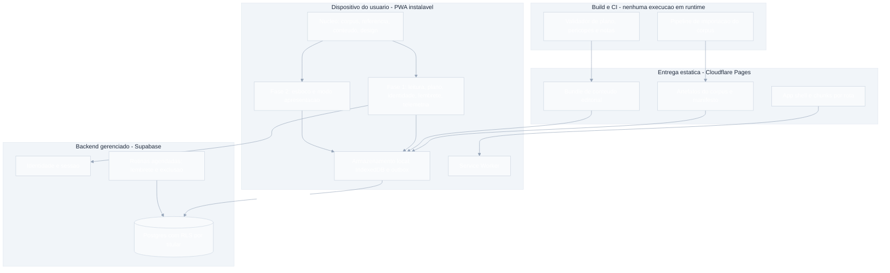
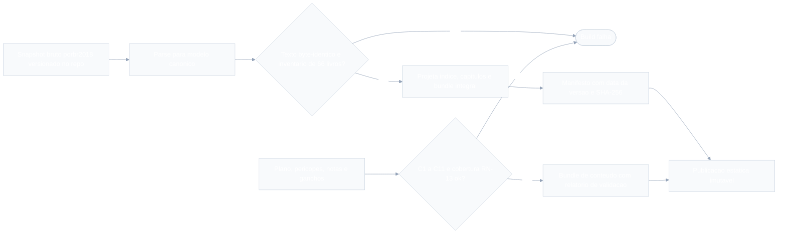
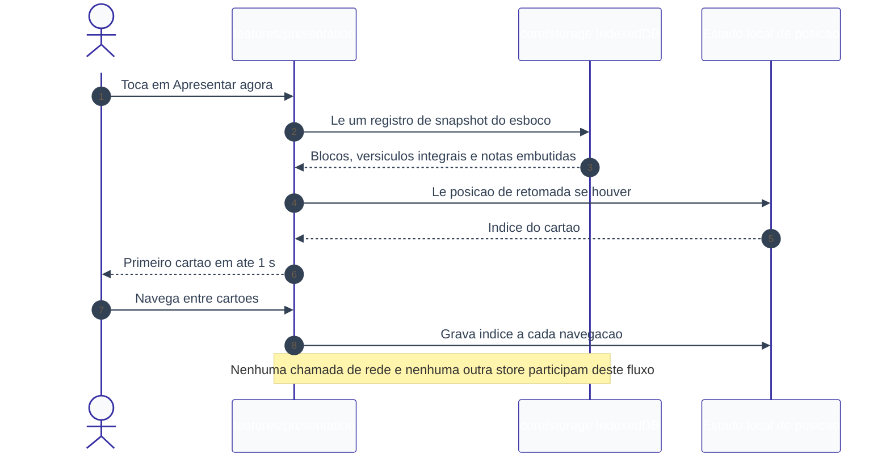
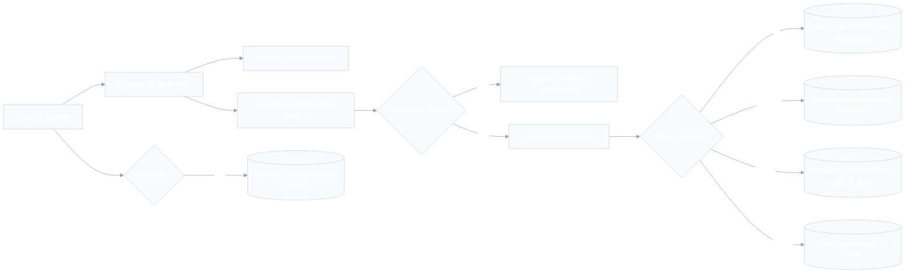
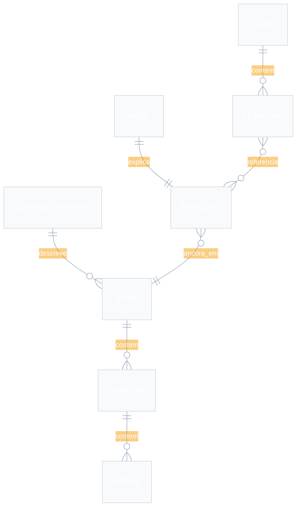
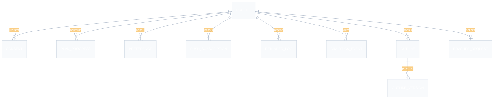

# SDD.md — App de Leitura Bíblica Guiada + Preparo de Estudo

- **Versão**: rascunho rodada 1 (Loop B do `/definir_organizar`)
- **Data**: 2026-09-07
- **Autor**: coordenador (chapéu Software Architect)
- **Base**: `.md/PRD-TECNICO.md`, `.md/PRD.md`, `.md/CTO-REVIEW.md` (Gate 1 + adendo)
- **Consumidores**: executor, validador, gestor
- **Status**: aguardando aprovação do usuário (orquestrador) junto de `UX-SPEC.md`.
  Enquanto não aprovado, todos os ADRs indexados na Seção 4 estão em `Proposed`.

> Este documento decide **arquitetura, stack e contratos estruturais**. Não decide
> requisito nem escopo: onde uma restrição de produto do `PRD-TECNICO.md` se mostrou
> cara ou de cobertura desigual, a decisão está registrada com o trade-off explícito e
> sinalizada ao Gestor (Seção 6), nunca resolvida em silêncio.

---

## 1. Visão Geral da Arquitetura

### 1.1 O formato da solução

O produto é um **PWA instalável, local-first**, em que o dispositivo é a sede da
lógica e do conteúdo, e o servidor é um substrato fino de identidade e sincronização.
Três artefatos estáticos imutáveis — **corpus**, **conteúdo editorial** e **código** —
são gerados em build, verificados por hash e servidos por um CDN sem cobrança de
banda; o cliente os consome, guarda no dispositivo e opera sobre eles sem depender de
rede para nada que seja leitura de Escritura, resolução de referência ou apresentação
de esboço. A escrita do usuário (progresso, preferências, esboços, telemetria
consentida) é gravada primeiro no dispositivo e reconciliada depois, por uma outbox,
contra um Postgres gerenciado onde cada linha pertence a um único titular e é isolada
por política declarativa no próprio banco.

A forma tem um nome curto: **núcleo compartilhado + duas funcionalidades empilhadas
sobre ele**. O núcleo (corpus, parser de referência, acervo de notas, armazenamento,
sincronização, design) é construído na Fase 1 e é o que torna o Módulo 2 barato; as
funcionalidades da Fase 2 dependem só do núcleo e são carregadas por rota própria, de
modo que a Fase 1 vai a produção sem que a Fase 2 exista — que é a mitigação declarada
do risco número um do projeto.

### 1.2 Como cada restrição dominante virou desenho

| Restrição | Onde está resolvida na arquitetura |
|---|---|
| **Um dev solo, infra limitada** (R-01) | Um runtime de cliente, um banco gerenciado, duas rotinas agendadas. Uma linguagem (TypeScript) do CLI de importação até a rotina de push. Nenhuma orquestração, nenhum broker, nenhum microserviço. Regra de negócio existe **uma vez**, no cliente (ADR-002) — não há par cliente/servidor para divergir. |
| **Custo marginal ≈ zero** (RNF-06, R-05) | Os bytes que escalam com adoção — corpus e app — vivem num CDN de banda ilimitada e cache imutável. Telemetria é first-party na base própria (ADR-009). Notificação usa Web Push com chave própria, sem serviço pago (ADR-010). Cada limite de plano gratuito tem gatilho declarado (ADR-008). |
| **Offline duro da apresentação** (RNF-01) | O esboço materializado é um **documento autocontido** no IndexedDB: em tempo de apresentação lê-se um registro e nada mais — nem cache HTTP, nem outra store, nem rede (ADR-006). O Módulo 2 provisiona o corpus integral na entrada, o que também satisfaz CA-13.3. |
| **Dado pessoal sensível** (RNF-05, LGPD art. 5º, II) | Nada pessoal sai do dispositivo antes do consentimento versionado; telemetria em dois níveis, sendo o pré-consentimento um agregado **sem sujeito** (ADR-009); zero script de terceiro por CSP `default-src 'self'`; isolamento por RLS; exclusão em cascata com SLA e expurgo de backup declarado (Seção 7). |
| **Corpus sem terceiro em runtime e byte-idêntico** (RNF-08, RNF-10, RN-06) | Pipeline de importação em build com verificação byte a byte que **falha o build**, manifesto com `sourceVersionDate` e SHA-256 por arquivo, e atribuição renderizada a partir do manifesto — nunca de constante em código (ADR-003). |
| **PWA-first sem fechar a porta ao nativo** | Domínio em TypeScript puro, sem React nem DOM, isolado em `core/*`; caminho mais barato para nativo é um wrapper reaproveitando app e artefatos (ADR-001, ADR-012). |
| **Fase 1 lançável sozinha** | Dependência unidirecional entre camadas, verificada por lint; Módulo 2 é chunk carregado por rota não registrada na Fase 1; migrations de esboço só existem na Fase 2 (ADR-012). |
| **WCAG 2.2 AA, ≥7:1 na apresentação** | Tokens de contraste em custom properties com teste automatizado sobre os pares de cor; componentes de sobreposição vindos de biblioteca acessível; semântica de versículo/nota como mecanismo de acessibilidade auditiva do MVP (ADR-011, `UX-SPEC.md` §5). |

### 1.3 Padrão arquitetural e por que ele

**Monólito modular local-first, com backend gerenciado mínimo.** A justificativa é de
volume, complexidade e equipe, nesta ordem:

- **Volume**: a meta declarada é 200 iniciantes em 90 dias (`PRD.md` §3.3). Nenhuma
  decisão de escala é justificável nessa faixa; a arquitetura precisa ser barata de
  operar, não elástica.
- **Complexidade**: o produto tem duas funcionalidades e um núcleo de conteúdo
  estático. Não há domínio transacional, não há concorrência entre usuários, não há
  fluxo assíncrono de longa duração. Serviços separados adicionariam contrato de rede
  entre partes que só se comunicam por chamada de função.
- **Equipe**: uma pessoa. **A simplicidade operacional foi o critério de decisão, não
  um efeito colateral** — cada ADR desta arquitetura declara isso explicitamente, e
  opções tecnicamente elegantes (serviços separados, CQRS, CRDT de texto, CMS
  headless, analytics gerenciado) foram descartadas por custo de operação, não por
  incapacidade técnica.

---

## 2. Componentes e Fluxo de Dados

### 2.1 Visão de componentes

### 2.2 Componentes, requisito de origem e fase

| Componente | O que faz | Requisitos de origem | Fase |
|---|---|---|---|
| `core/corpus` | Acesso ao texto bíblico local, índice de livros/capítulos/versículos, atribuição derivada do manifesto | RF-01, RN-06, RNF-08, RNF-10 | 1 |
| `core/reference` | Reconhecimento e normalização de referência bíblica; resolução da nota associada a um intervalo | RN-05, RN-13, CA-13.1 a CA-13.5 | 1 |
| `core/content` | Leitura do bundle editorial: plano, perícopes, notas, ganchos | RF-02, RF-06, RN-01, RN-04, RN-13 | 1 |
| `core/storage` | Stores locais tipadas, versionamento e migração de schema local, orçamento e expurgo LRU | RNF-03, RN-10 | 1 |
| `core/sync` | Outbox, envio em lote, conciliação por entidade, migração de progresso anônimo | RF-11, RN-07, RN-08, RNF-12 | 1 |
| `core/design` | Tokens, primitivos acessíveis, temas claro/escuro/apresentação | RNF-04, CA-14.6 | 1 |
| `features/reading` | Navegação por livro e capítulo, leitor, nota na leitura livre, atribuição | RF-01, CA-01.6 | 1 |
| `features/plan` | Dia do plano, conclusão, dia corrente, constância, gancho, vitrine, tela de conclusão | RF-02, RF-03, RF-04, RF-08, RF-20, RN-02, RN-09 | 1 |
| `features/identity` | Cadastro, login, recuperação, consentimento, soft gate, exportação, exclusão | RF-09, RF-10, RNF-05, RN-03, RN-11 | 1 |
| `features/engagement` | Assinatura de push, preferência de horário, estado real do canal, gancho in-app | RF-05, RN-04, CA-05.5 | 1 |
| `features/telemetry` | Fila de eventos, agregados anônimos, envio pós-consentimento | RF-18, CA-09.5, CA-18.1 a CA-18.4 | 1 |
| `features/outline` | Esboço, blocos tipados, auto-embed, duplicação, materialização, versões recuperáveis | RF-12, RF-13, RF-16, RF-17, RF-19, RN-10, RN-12 | 2 |
| `features/presentation` | Modo apresentação, navegação por cartão, retomada, tela acesa | RF-14, RF-15, RN-14, RNF-01 | 2 |
| `jobs/reminder` | Seleção e envio dos lembretes devidos, log de desfecho | RF-05, CA-05.4, CA-05.7 | 1 |
| `jobs/erasure` | Execução das exclusões pendentes dentro do SLA | RN-11, RNF-05 | 1 |
| `tools/corpus-import` | Aquisição, parse, verificação byte a byte, projeção e manifesto | RNF-08, RNF-10, RN-06, E-01 | 1 |
| `tools/content-validate` | Verificação de C1–C11 e da cobertura de RN-13; veto de publicação | CA-02.5, CA-06.6, RN-01, RN-13 | 1 |

Nenhum componente existe sem requisito de origem. Componentes que seriam naturais em
outro projeto e **não** existem aqui, por ausência de requisito: busca full-text
(F-05), camada de cache de servidor, fila de mensagens, serviço de mídia (F-03),
gateway de API.

### 2.3 Integrações externas como fronteiras explícitas

| # | Dependência (`PRD-TECNICO.md` §5.2) | Fronteira na arquitetura | Momento |
|---|---|---|---|
| E-01 | Corpus BLIVRE | `tools/corpus-import`, **só em build**; o snapshot bruto é versionado no repositório | Build |
| E-03 | Canal de notificação | `features/engagement` (assinatura no navegador) + `jobs/reminder` (envio Web Push com VAPID próprio) | Runtime |
| E-04 | Provedor de autenticação | `features/identity` contra o serviço de identidade do Supabase; nenhuma rede social como caminho único | Runtime |
| E-05 | Persistência e sincronização | `core/sync` contra Postgres via API gerada, sempre autenticada e sob RLS | Runtime |
| E-06 | Hospedagem/entrega do PWA | Cloudflare Pages; corpus e conteúdo entregues pelo mesmo domínio estático | Runtime |
| E-07 | Instrumentação | `features/telemetry` contra tabela própria; **nenhum destino de terceiro existe** — garantido por CSP | Runtime |
| E-08 | Acervo editorial | `content/` no repositório, com veto de publicação por `tools/content-validate` | Build |

### 2.4 Fluxo de dados — pipeline de conteúdo (build)

O nó `verify` implementa RNF-10; o nó `cval` implementa CA-02.5 e CA-06.6. Os dois
convergem no mesmo `fail`: **não existe caminho que publique conteúdo inválido**.

### 2.5 Fluxo de dados — modo apresentação sem rede (o caminho crítico)

Este diagrama é a especificação executável de RNF-01: o teste e2e correspondente roda
com rede desligada **e** com o cache HTTP e a store de capítulos limpos, e ainda assim
tem de passar. Qualquer requisição observada nesta janela é defeito de severidade
máxima (M-04).

### 2.6 Fluxo de dados — escrita local, conciliação e telemetria

**Verificação métrica a métrica** de que a fronteira de privacidade não perde nenhuma
métrica do `PRD.md` §3:

| Métrica | Como é apurada sob ADR-009 |
|---|---|
| D30 (primária) | Eventos identificados de coorte semanal de início de plano; só existe para quem tem conta — que é a definição de "iniciou o plano" com progresso persistido |
| M-02 (muro do árido) | Evento de conclusão de dia carrega a classificação da porção de AT |
| M-03 (recorrência do Módulo 2) | Criação e duplicação de esboço; Módulo 2 sempre exige conta |
| M-04 (falha offline) | Contador agregado + evento identificado quando há conta; meta = 0, qualquer ocorrência é defeito |
| M-06 (soft gate) | **Contador agregado anônimo** — cobre inclusive quem recusou e nunca criou conta |
| M-07 (sessão 2 em 48 h) | Eventos anônimos guardados **localmente** e migrados com `occurred_at` original ao consentir |
| M-08 (eficácia do gancho) | `reminder_log` no servidor cruzado com conclusão do dia; segmentado por disponibilidade de push |

---

## 3. Stack Tecnológica e Justificativa

Toda linha abaixo tem alternativa considerada e trade-off declarado. O critério
transversal de desempate, em todas elas, é **operabilidade por uma pessoa**.

| Camada | Escolha | Alternativa considerada | Trade-off central |
|---|---|---|---|
| Linguagem | TypeScript, do CLI de importação à rotina agendada | JavaScript puro; Python nos CLIs | Uma linguagem para uma pessoa, e o domínio compilado roda literalmente nos três contextos. Custo: build step em tudo, inclusive em script de uso único. |
| Cliente | React + Vite, SPA com rotas públicas pré-renderizadas | Next.js com SSR; SvelteKit; Astro | Sem servidor de renderização para operar e LCP atingido por HTML pré-renderizado. Custo: conteúdo dinâmico não indexável, o que dói com F-13 (sem site institucional) e Q-07 em aberto. |
| PWA | `vite-plugin-pwa` com Workbox | Service Worker escrito à mão | Estratégias de cache declarativas e testadas; menos superfície para errar no ponto que mais dói (RNF-01). Custo: uma abstração a entender quando algo não cacheia como o esperado. |
| Armazenamento local | Dexie sobre IndexedDB | `idb` cru; OPFS; SQLite via WASM | Versionamento e migração de schema local desde o dia 1, que a outbox e os snapshots exigem. Custo: ~25 KB e uma dependência. SQLite/WASM foi descartado por peso e por não haver consulta que o justifique. |
| Componentes | HTML semântico + Radix Primitives só em sobreposições | Kit visual completo; tudo à mão | Armadilha de foco, `aria-modal` e região viva vêm testados — a parte de WCAG que projeto solo erra. Custo: mais CSS próprio; nenhum atalho visual pronto. |
| Estilo | CSS Modules + tokens em custom properties | Tailwind; CSS-in-JS | Contraste vira teste automatizado sobre pares de token (≥ 7:1 na apresentação). Custo: disciplina manual de nomenclatura. |
| Backend | Supabase: Postgres, identidade, API gerada, RLS, Edge Functions, `pg_cron` | Cloudflare Workers + D1 com autenticação própria; Firebase; VPS | Identidade completa e isolamento declarativo sem código próprio, sobre SQL padrão e portável. Custo: fornecedor gerenciado guardando dado sensível; PostgREST exige RLS em **toda** tabela, sem exceção. |
| Entrega estática | Cloudflare Pages | Vercel; Netlify; o próprio Supabase Storage | Banda de saída não medida — remove a última fonte de custo variável (o corpus). Custo: um segundo fornecedor e um segundo painel. |
| Notificação | Web Push com VAPID próprio | OneSignal; e-mail diário; FCM direto | Custo zero em qualquer escala e nenhum SDK de terceiro. Custo: cobertura desigual no iOS e trabalho de infraestrutura próprio (chaves, assinaturas expiradas). |
| E-mail | SMTP externo em plano gratuito, **só transacional de identidade** | E-mail como canal de lembrete diário | Volume por conta, não por dia — não escala com adoção. Custo: sem canal alternativo de lembrete (ver RT-02). |
| Testes | Vitest (unidade) + Playwright (e2e, incluindo offline) | Jest; Cypress | Um runner alinhado ao Vite; Playwright cobre offline, permissões e múltiplos navegadores de RNF-07. Custo: navegadores baixados em CI. |
| CI/CD | GitHub Actions: valida corpus, valida conteúdo, testa, publica | Deploy manual; CI do próprio provedor | O veto de CA-02.5 precisa morar num pipeline que ninguém contorna. Custo: minutos de CI a gerir. |

**Estratégia mobile (registro do `mobile-platform-strategy`)**: a premissa foi
questionada antes da comparação — o produto precisa de app instalado? Só por push e
por armazenamento estável, e ambos são atingíveis com PWA **instalado**. O fator
decisivo declarado é competência e capacidade de operação de uma pessoa, não teto de
desempenho; nativo e cross-platform foram descartados por ciclo de loja e segundo
runtime, e não por limitação técnica. O caminho de saída, se a cobertura de push no
iOS se mostrar inaceitável na medição de M-08, é um wrapper Capacitor sobre o mesmo
app — não uma reescrita. Detalhe e tabela comparativa em ADR-001.

---

## 4. Decisões Arquiteturais (índice de ADRs)

Todos em `Proposed` nesta rodada; a aprovação do usuário ao final do Loop B promove o
conjunto a `Accepted` pela linha de status, sem edição de conteúdo (regra de
imutabilidade de ADR).

| ADR | Título | Status | Decisão em uma linha |
|---|---|---|---|
| [001](adr/001-adotar-pwa-instalavel-como-unica-plataforma-cliente-do-mvp.md) | Adotar PWA instalável como única plataforma cliente do MVP | Proposed | PWA instalável agora, wrapper nativo como saída barata depois; offline e push resolvidos sem shell nativo. |
| [002](adr/002-concentrar-a-logica-de-negocio-no-cliente-com-servidor-de-sincronizacao.md) | Concentrar a lógica de negócio no cliente e manter o servidor como substrato de sincronização e identidade | Proposed | Uma implementação por regra, no cliente; servidor decide só identidade, propriedade da linha e conciliação. |
| [003](adr/003-importar-o-corpus-blivre-em-build-como-artefato-estatico-verificado.md) | Importar o corpus BLIVRE em build como artefato estático versionado e verificado por hash | Proposed | Corpus vira artefato imutável com verificação byte a byte e manifesto que gera a atribuição. |
| [004](adr/004-tratar-plano-e-notas-como-conteudo-versionado-com-validador-bloqueante.md) | Tratar plano, perícopes, notas e ganchos como conteúdo versionado, com validador executável bloqueando a publicação | Proposed | Conteúdo é código; C1–C11 e a cobertura de RN-13 viram gate de CI com poder de veto. |
| [005](adr/005-implementar-o-reconhecimento-de-referencia-como-modulo-puro.md) | Implementar o reconhecimento de referência bíblica como módulo puro compartilhado, com resolução conservadora | Proposed | Função pura com retorno `Resolved`/`Unresolved`; ambiguidade nunca vira palpite. |
| [006](adr/006-garantir-o-offline-duro-por-esboco-autocontido.md) | Garantir o offline duro por esboço autocontido e provisionamento integral do corpus no Módulo 2 | Proposed | Apresentar lê um registro autocontido; nada é resolvido em tempo de apresentação. |
| [007](adr/007-sincronizar-por-outbox-local-com-regra-por-entidade.md) | Sincronizar por outbox local com regra de conciliação por entidade | Proposed | Escreve local primeiro; união monotônica no schema, LWW com versão perdedora preservada. |
| [008](adr/008-usar-supabase-como-backend-gerenciado-e-cloudflare-pages-como-entrega.md) | Usar Supabase como backend gerenciado e Cloudflare Pages como entrega estática | Proposed | Identidade e RLS prontos sobre SQL portável; banda do corpus num CDN sem cobrança. |
| [009](adr/009-instrumentar-com-telemetria-first-party-em-dois-niveis.md) | Instrumentar com telemetria first-party em dois níveis | Proposed | Agregado sem sujeito antes do consentimento, evento identificado depois; nenhum terceiro. |
| [010](adr/010-entregar-o-lembrete-por-web-push-com-chaves-proprias.md) | Entregar o lembrete por Web Push com chaves próprias e não adotar e-mail como canal diário | Proposed | Push gratuito + convite de instalação + gancho in-app garantido; e-mail só transacional. |
| [011](adr/011-adotar-react-typescript-e-vite-com-tokens-em-css-custom-properties.md) | Adotar React, TypeScript e Vite com Workbox, Dexie e tokens em CSS custom properties | Proposed | Stack de cliente mínima, com contraste testável e domínio agnóstico de framework. |
| [012](adr/012-separar-fase-1-e-fase-2-em-modulos-com-dependencia-unidirecional.md) | Separar Fase 1 e Fase 2 em módulos de funcionalidade com dependência unidirecional | Proposed | Fase 1 lançável sozinha vira propriedade do build, verificada por lint e por rota não registrada. |

---

## 5. Modelo de Dados de Alto Nível

Três domínios de dado, com ciclos de vida diferentes: **estático imutável** (build),
**local do dispositivo** (IndexedDB) e **do titular no servidor** (Postgres).

### 5.1 Conteúdo estático (gerado em build, imutável, sem PII)

| Entidade | Campos essenciais | Regra de origem |
|---|---|---|
| `CorpusManifest` | `sourceId`, `sourceVersionDate`, `importedAt`, `license`, `licenseUrl`, `holders`, `modifications`, `sha256[]` | RN-06, RNF-10 |
| `Book` / `Chapter` / `Verse` | `bookId`, nome canônico, abreviações aceitas, número, texto | RF-01, RN-05 |
| `Pericope` | `id`, `bookId`, `startChapter/Verse`, `endChapter/Verse`, título curto | RN-13 |
| `Note` | `id`, `pericopeId`, corpo (120–200 palavras), `author`, `reviewer`, `reviewedAt` | RF-06, RN-04, CA-06.3, CA-06.4 |
| `PlanDay` | `dayNumber`, porção AT (referência + categoria de RN-01), porção NT, `noteIds[]`, `hook` (≤140), contagem de palavras | RN-01 C1–C11, RN-04 |
| `Plan` | `id`, nome exibido, `dayCount`, `validationReport` | CA-02.5, C10 |

**Não** existem aqui: dia-calendário, usuário, progresso. O plano é definição, não
estado — o estado do usuário é a relação `(usuário, dia)` do §5.3, o que é o que torna
RN-09 ("o plano anda com o usuário") verdadeiro por modelagem.

### 5.2 Dado local do dispositivo (IndexedDB)

| Store | Conteúdo | Sincroniza? |
|---|---|---|
| `corpusChapters` | Capítulos lidos, cache oportunista com LRU | Não (é cache de estático) |
| `corpusBundle` | Corpus integral, provisionado na entrada do Módulo 2 | Não |
| `contentBundle` | Plano, perícopes, notas, ganchos | Não |
| `anonProgress` | Dias concluídos sem conta, com `completedAt` | Migra uma vez (RN-07) |
| `progress` | Dias concluídos do titular | Sim, união monotônica |
| `preferences` | Horário de lembrete, tema, `updatedAt` | Sim, LWW |
| `outlines` | Esboço editável: título, blocos, `rev`, `baseRev`, `updatedAt` | Sim, LWW no esboço |
| `outlineSnapshots` | **Documento autocontido** de apresentação: blocos + versículos integrais + notas + versões de corpus/conteúdo | Não — é derivado local |
| `presentationState` | `outlineId`, índice do cartão, `interruptedAt` | **Nunca** (RN-08, RN-14) |
| `outbox` | Mutações pendentes com id próprio e `baseRev` | É o mecanismo |
| `eventQueue` | Eventos ainda não enviados (inclusive pré-conta) | Sim, após consentimento |

### 5.3 Dado do titular no servidor (Postgres)

| Tabela | Campos essenciais | Regra / requisito | Fase |
|---|---|---|---|
| `profile` | `user_id` (do provedor de identidade), `created_at` | RF-10 | 1 |
| `consent` | `user_id`, `version`, `text_sha256`, `accepted_at`, `revoked_at` | RNF-05, CA-10.2 | 1 |
| `plan_progress` | `user_id`, `plan_id`, `day_number`, `completed_at`; `UNIQUE(user_id, plan_id, day_number)`, append-only | RN-08 (união), CA-03.5, CA-11.3 | 1 |
| `preference` | `user_id`, `key`, `value`, `updated_at` | RN-08 (LWW) | 1 |
| `push_subscription` | `user_id`, endpoint, chaves, `platform`, `last_seen_at` | RF-05 | 1 |
| `reminder_log` | `user_id`, `scheduled_for`, `sent_at`, `outcome`, `channel` | CA-05.7, M-08 | 1 |
| `analytics_event` | `user_id`, `type`, `occurred_at`, `received_at`, `payload` | RF-18, CA-18.4 | 1 |
| `analytics_daily_aggregate` | `date`, `metric`, `count` — **sem coluna de sujeito** | CA-09.5, M-06, ADR-009 | 1 |
| `erasure_request` | `user_id`, `requested_at`, `due_at`, `completed_at` | RN-11 (≤15 dias) | 1 |
| `outline` | `id`, `user_id`, `title`, `blocks` (JSONB), `rev`, `updated_at`, `deleted_at` | RF-12, RF-16, RN-12 | 2 |
| `outline_version` | `id`, `outline_id`, `user_id`, `blocks`, `superseded_at`, `expires_at` | RNF-12 (≥30 dias) | 2 |

**Entidades deliberadamente ausentes do servidor**: constância e streak (derivados —
RN-08), dia corrente (derivado — RN-09), posição de apresentação (local — RN-14),
snapshot materializado (local — RN-10), qualquer cópia do corpus ou das notas
(estático — RNF-08).

**Bloco do esboço** é JSONB dentro de `outline`, não tabela própria: os quatro tipos
são fechados (RN-12), a hierarquia é proibida (F-16), não há consulta por bloco (F-05)
e a conciliação é no nível do esboço (RN-08). Normalizar traria custo sem consumidor.

### 5.4 Glossário de linguagem ubíqua

Identificadores de código em inglês; termo de domínio em português no produto.

| Domínio (pt-BR) | Código | Observação |
|---|---|---|
| Perícope | `pericope` | Unidade de sentido; **nunca** aparece na interface (público não sabe o termo — `PRD.md` §2.1) |
| Nota de Perícope | `note` | Na interface: "Nota de contexto" |
| Dia do plano | `planDay` | Nunca confundir com dia-calendário (`calendarDay`) |
| Gancho de continuidade | `hook` | ≤ 140 caracteres |
| Constância | `consistency` | "dias lidos nos últimos 30" |
| Esboço | `outline` | |
| Materializado | `materialized` | Snapshot autocontido presente e verificado |
| Cartão | `card` | Um bloco no modo apresentação |

---

## 6. Riscos Técnicos e Dívida Técnica Aceita

### 6.1 Riscos técnicos

| ID | Risco | Severidade | Gatilho de materialização | Mitigação na arquitetura | Sinal de monitoramento |
|---|---|---|---|---|---|
| **RT-01** | **Expurgo de armazenamento pelo navegador antes da apresentação.** Safari/iOS apaga armazenamento gravável por script após ~7 dias sem uso do site, exceto em PWA instalado. O cenário do produto é literalmente "preparo num domingo, prego no outro" | **Alta** — ameaça direta a RNF-01 e a M-04 (meta 0) | Usuário iOS que não instalou o PWA e ficou 7+ dias sem abrir | `storage.persist()`; convite de instalação antes da primeira apresentação; selo de materialização **verificado**, não lembrado; rematerialização automática com rede (ADR-006) | Contador `falha_offline_apresentacao` e taxa de instalação por plataforma |
| **RT-02** | **Cobertura desigual do lembrete.** Sem push no iOS não instalado e sem canal alternativo (e-mail diário recusado por RNF-06), parte do público não recebe o gancho | **Alta** — RF-05 é Must e P-13 depende dele | Fatia relevante de iOS não instalado na base | Convite de instalação; gancho in-app garantido (CA-05.5); estado real do canal exibido nas configurações (ADR-010) | M-08 **segmentada** por disponibilidade de push; se a diferença for grande, a leitura de P-13 fica contaminada — **decisão de negócio, sinalizada ao Gestor** |
| **RT-03** | **Acervo editorial não pronto no lançamento** (G-01/P-06). É risco de projeto, mas com consequência arquitetural: o plano B é encurtar o plano | **Alta** | Menos de ~90 notas escritas e revisadas | `dayCount` é parâmetro do validador, não constante; nota ancorada à perícope sobrevive à mudança do plano (ADR-004) | Cobertura do validador: notas existentes ÷ dias do plano |
| **RT-04** | **Tabela sem RLS habilitada vaza dado sensível.** A API é gerada a partir do schema; esquecer a política é publicar a tabela | **Alta** | Qualquer migration nova | RLS obrigatória em toda tabela com `user_id`; teste automatizado que percorre o catálogo e falha se houver tabela sem política; regra inegociável em `GUARDRAILS.md` | Teste de política no CI; revisão do Validador (DevSecOps) |
| **RT-05** | **Regressão do parser de referência** inserindo versículo errado num esboço | **Alta** (dano em público, RN-05) | Alteração na tabela de abreviações ou na gramática | Suíte simétrica: casos que devem resolver **e** casos que não podem resolver; retorno em soma de tipos (ADR-005) | Falha na tabela negativa é bloqueio de deploy |
| **RT-06** | **Relógio do dispositivo incorreto** afeta LWW de preferências/esboços e a janela de 48 h de M-07 | Média | Aparelho com data errada ou fuso trocado | Servidor grava `received_at` além do `updated_at`; apuração descarta divergência absurda; nunca corrige dado do usuário em silêncio (ADR-007) | Distribuição de `received_at − occurred_at` |
| **RT-07** | **Pontualidade do agendamento** do lembrete em plano gratuito; atraso de minutos | Média | Concorrência de carga no provedor | `reminder_log` com `scheduled_for` e `sent_at`; envio idempotente por dia | Atraso mediano por dia; se passar de ~10 min, reavaliar |
| **RT-08** | **Estouro do orçamento de 50 MB** (RNF-03) com bundle integral + snapshots + capítulos | Média | Muitos esboços grandes materializados | Ordem de expurgo declarada; snapshot materializado nunca descartado em silêncio (ADR-006) | Uso de quota reportado por `storage.estimate()` |
| **RT-09** | **Dado sensível em fornecedor gerenciado** sem parecer jurídico (G-03 aberto) | Média-alta em compliance | Lançamento público | Portabilidade por SQL padrão e `pg_dump`; região de hospedagem e retenção de backup declaradas ao titular (Seção 7) | Item obrigatório do `SECURITY-REVIEW.md` |
| **RT-10** | **Cliente autoritativo permite falsificar o próprio progresso**, poluindo métricas | Baixa-média | Usuário curioso com devtools | Sem incentivo (F-17 proíbe gamificação); invariantes que importam são restrições de banco (ADR-002) | Outliers na distribuição de conclusões por dia-calendário |
| **RT-11** | **Envelhecimento do snapshot**: esboço antigo apresenta versão anterior da nota | Baixa | Esboço não aberto por muitas versões | Versão de corpus/conteúdo gravada no snapshot; rematerialização com rede | Diferença de versão registrada ao abrir |

### 6.2 Dívida técnica aceita conscientemente

| # | Dívida | Por que é aceita agora | Quando cobrar |
|---|---|---|---|
| DT-01 | **Sem renderização no servidor** — conteúdo dinâmico não indexável | O site institucional está fora do escopo (F-13) e a aquisição é um problema de canal, não de SEO, nesta fase | Quando Q-07 for respondida com "orgânico" |
| DT-02 | **Sem CMS: autoria de conteúdo exige git** | Nenhum CMS gratuito e sem custo por uso entrega o veto de CA-02.5; o custo recai sobre uma pessoa que já é a autora | Se a fricção de autoria atrasar o acervo (RT-03) |
| DT-03 | **Sem merge de blocos no esboço** (LWW + versão recuperável) | Decisão de produto em I-06; merge automático de texto corrompe em silêncio | Se houver evidência real de edição concorrente frequente |
| DT-04 | **Leitura do Módulo 1 não é offline garantida** (F-14) | Só a apresentação tem offline duro; estender ampliaria muito o esforço | Pós-MVP, com o corpus já provisionável |
| DT-05 | **Sem observabilidade dedicada** — sem APM, sem rastreamento distribuído | Plataforma pequena; erro é registrado em tabela própria com amostragem e teto diário, sob as mesmas regras de privacidade | Quando houver mais de um ambiente ou mais de uma pessoa |
| DT-06 | **Ambiente único (produção) + pré-visualização por branch** | Um dev solo não amortiza um staging completo; testes e2e cobrem o caminho crítico | Antes do primeiro usuário pagante (P-04) |
| DT-07 | **Duplicação deliberada de bytes**: corpus em capítulos e em bundle integral; versículo no corpus e dentro do snapshot | Garantia de RNF-01 vale mais que espaço; fonte canônica única no pipeline | Se RNF-03 apertar (RT-08) |
| DT-08 | **Nenhuma validação de invariante de negócio no servidor** | Consequência escolhida de ADR-002, com limite declarado (dado privado, sem valor econômico) | Se surgir cobrança, compartilhamento ou plano de igreja (F-10) |

---

## 7. Requisitos de Segurança e Compliance

Requisitos de **arquitetura**, insumo para o Validador (chapéu DevSecOps). Não
substituem SAST/DAST, varredura de dependências nem hardening tático, e não substituem
parecer jurídico (G-03 segue aberto).

### 7.1 Autenticação

- **Usuário final**: e-mail + senha com verificação de e-mail, mais link mágico como
  alternativa. Rede social **não** pode ser o caminho único (restrição de E-04) e não
  entra no MVP — cada provedor adicional é uma superfície a manter.
- **Sessão**: token de acesso de vida curta (≤ 1 h) com refresh rotativo; a sessão
  persiste no dispositivo porque o produto precisa abrir autenticado sem rede.
  Requisito associado: **nenhum segredo além do token de sessão** é gravado em
  armazenamento do navegador, e nenhum conteúdo do usuário é gravado em
  `localStorage` (só IndexedDB).
- **Sem conta**: navegar o corpus, abrir qualquer dia do plano e ler notas não exigem
  identidade (RN-03, CA-09.1). O Módulo 2 exige sessão válida **antes** de qualquer
  acesso, inclusive à lista (CA-09.4, CA-16.5) — a rota não é registrada sem sessão.
- **Serviço a serviço**: as rotinas agendadas usam credencial de serviço que existe
  **apenas** no ambiente do backend. Requisito verificável: a chave de serviço nunca
  aparece em bundle de cliente, e o CI falha se aparecer.
- **Recuperação de acesso**: por e-mail, com token de uso único e expiração curta;
  nunca revela se o endereço existe.

### 7.2 Autorização

Modelo: **propriedade simples por titular** (ownership). Não há papéis, não há
hierarquia, não há administrador de conteúdo de usuário — F-09 e F-10 removeram os
requisitos que criariam isso.

| Recurso | Regra | Requisito de origem |
|---|---|---|
| `plan_progress`, `preference`, `push_subscription`, `reminder_log`, `analytics_event`, `outline`, `outline_version`, `erasure_request` | `SELECT/INSERT/UPDATE/DELETE` apenas quando `user_id = ` identidade da sessão, por política no banco | RNF-09 |
| `analytics_daily_aggregate` | Sem leitura pelo cliente. Escrita apenas por função com privilégio definido que **incrementa contador**, sem aceitar identificador | ADR-009, CA-09.5 |
| Conteúdo estático (corpus, notas, plano) | Público, sem autenticação — é obra licenciada e obra própria destinada a leitura sem conta | RN-03, CA-06.7 |
| `outline` compartilhado | **Não existe**: esboço é privado por padrão e o MVP não oferece compartilhamento | RNF-09, F-09 |

Requisito estrutural: **toda** tabela com coluna `user_id` nasce com RLS habilitada na
mesma migration que a cria. Uma tabela sem política é indistinguível de uma tabela
pública, porque a API é gerada a partir do schema (RT-04).

### 7.3 Criptografia

| Dado | Em trânsito | Em repouso |
|---|---|---|
| Credenciais e sessão | TLS 1.2+ obrigatório, HSTS, redirecionamento permanente para HTTPS | Senha com hash pelo provedor de identidade; token de sessão com expiração curta |
| Progresso, preferências, esboços, eventos (dado sensível) | TLS 1.2+ | Criptografia de volume do provedor (AES-256) + isolamento por RLS |
| Corpus e notas | TLS | Não aplicável — conteúdo público, integridade garantida por SHA-256 no manifesto |
| Dado local no dispositivo | Não aplicável | **Não é criptografado**. Limite declarado honestamente: a proteção é o isolamento de origem do navegador e o bloqueio de tela do aparelho. Consequência: o produto não promete confidencialidade contra quem tem o aparelho desbloqueado em mãos; e nenhum dado além do necessário à operação offline é mantido localmente |
| Chaves VAPID e credencial de serviço | — | Apenas em segredo de ambiente do CI/backend; nunca no repositório, nunca no bundle |

### 7.4 Isolamento multi-tenant

**Não aplicável — o sistema é single-tenant por natureza**: não há organização,
igreja ou grupo como entidade (F-10 mantém isso fora do MVP). O isolamento exigido é
**por titular**, entre usuários individuais, e está definido em §7.2 (RNF-09).

### 7.5 Superfície de exposição

| Superfície | Exposta a | Proteção mínima exigida |
|---|---|---|
| PWA e artefatos estáticos (CDN) | Internet aberta | HTTPS + HSTS; `Content-Security-Policy: default-src 'self'` com conexão permitida **apenas** ao domínio do backend; sem `unsafe-inline`; `frame-ancestors 'none'`; `Referrer-Policy: no-referrer`; `Permissions-Policy` negando câmera, microfone e geolocalização (nenhuma é usada) |
| API de dados (gerada do schema) | Internet aberta, sempre autenticada | RLS em toda tabela; limite de requisição do provedor; teto de inserção de eventos por usuário por dia, aplicado por gatilho no banco |
| Serviço de identidade | Internet aberta | Limite de tentativas do provedor; senha mínima e verificação de vazamento conhecido; sem enumeração de e-mail; **sem CAPTCHA de quebra-cabeça** (WCAG 2.2, 3.3.8) |
| Rotinas agendadas | Somente rede interna do provedor | Credencial de serviço em segredo; sem endpoint HTTP público |
| Service Worker | Origem do app | Escopo restrito; atualização forçada por versão; **proibido** cachear resposta de API autenticada |

A CSP é também o mecanismo que garante mecanicamente duas exigências de produto: **sem
anúncio de terceiro em nenhuma tela** (CA-08.2) e **sem analytics de terceiro com
finalidade publicitária** (E-07). Não há origem permitida para onde vazar.

### 7.6 LGPD — dado pessoal sensível (art. 5º, II)

| Obrigação | Requisito concreto de arquitetura |
|---|---|
| Base legal: consentimento específico e destacado (RNF-05, CA-10.2) | Tela própria no cadastro, texto versionado; registro em `consent` com `version`, `text_sha256` e `accepted_at`. **Nenhuma escrita de dado pessoal no servidor ocorre antes de existir a linha de consentimento** — garantido por política no banco, não por ordem de chamadas no cliente |
| Recusa do consentimento (CA-10.5) | O usuário permanece no modo sem conta com todas as funções de CA-09.1; o dado continua local e nada sobe |
| Minimização | Nenhum dado é coletado sem métrica declarada no `PRD.md` §3 ou requisito funcional. Não são coletados: IP em telemetria, user-agent, localização, contatos, identificador de dispositivo estável |
| Anonimato antes do consentimento | Agregado diário **sem sujeito** (ADR-009); é o único dado pré-consentimento que sai do dispositivo |
| Exclusão em ≤ 15 dias (RN-11) | `erasure_request` com `due_at = requested_at + 15 dias`; rotina diária apaga em cascata `profile`, progresso, preferências, assinaturas, log de lembrete, eventos, esboços e versões. Irreversibilidade avisada antes da confirmação. Agregados anônimos não são afetados — e o texto de exclusão diz isso |
| Backups (RN-11) | Retenção de backup **declarada ao titular** na tela de exclusão e na política de privacidade, com o expurgo ocorrendo no ciclo de retenção seguinte. O valor exato depende do plano contratado e precisa ser confirmado antes do lançamento — item para o Validador |
| Portabilidade (CA-10.4) | Exportação autenticada em JSON legível por máquina, com progresso, preferências e esboços |
| Telemetria como dado sensível (CA-18.4) | Eventos identificados vivem sob as mesmas RLS e a mesma cascata de exclusão; nenhum destino externo |
| Transparência de licença (RN-06) | Atribuição derivada do manifesto, com a data da versão, acessível a no máximo um toque de qualquer tela com texto bíblico (CA-01.3), e nota sempre visualmente distinta da Escritura (CA-06.3, RNF-10) |

### 7.7 Integridade de conteúdo como requisito de segurança

Não é segurança de informação clássica, mas o dano é reputacional e público:

- Nenhum caminho de código altera texto de versículo; a renderização recebe string e
  aplica só formatação de apresentação (RNF-10).
- Conteúdo de nota e de bloco de esboço é renderizado com sanitização; **nenhum HTML
  do usuário ou do acervo é injetado sem sanitizar** — inclusive porque o acervo vem
  de Markdown escrito por humano (ADR-004).
- O produto nunca exibe "Almeida Atualizada", "ARA" ou "ARC" (R-02, CA-01.5). Teste
  automatizado que falha se qualquer uma dessas strings aparecer no bundle.
