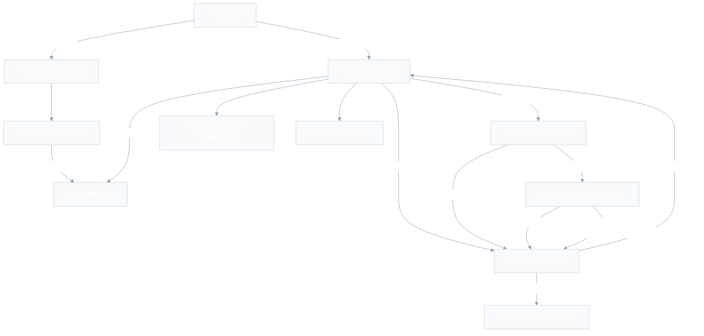
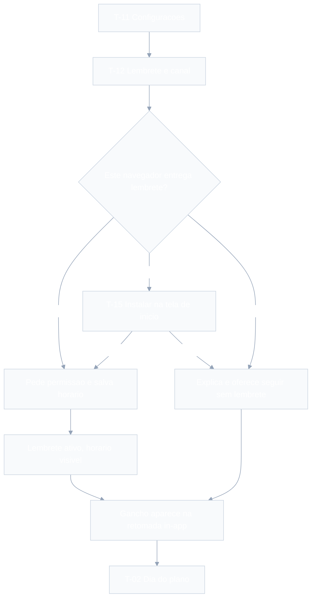
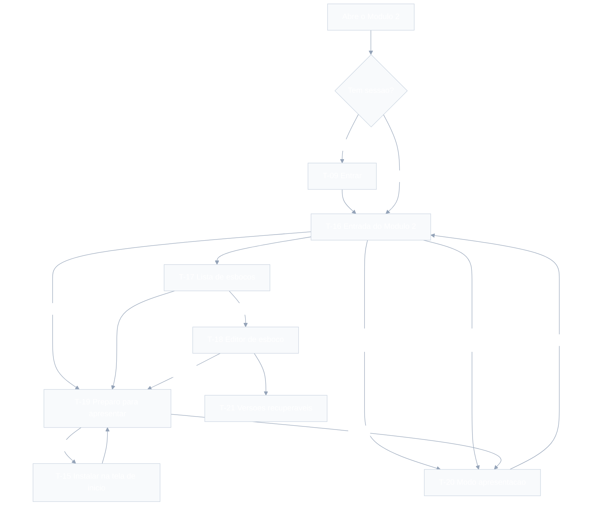

# UX-SPEC.md — App de Leitura Bíblica Guiada + Preparo de Estudo

- **Versão**: rascunho rodada 1 (Loop B do `/definir_organizar`)
- **Data**: 2026-09-07
- **Autor**: coordenador (chapéu UX/UI)
- **Base**: `.md/PRD-TECNICO.md` (fluxos §4, RFs §1, RNFs §2), `.md/PRD.md`,
  `.md/SDD.md` e os ADRs 001–012 — produzidos pela mesma instância, na mesma sequência
- **Consumidores**: executor, validador, gestor
- **Status**: aguardando aprovação do usuário (orquestrador) junto do `SDD.md`

> **Nota de partida**: o projeto é greenfield e **não existe design system anterior**.
> Este documento estabelece o primeiro. Por consequência, **todo** componente da Seção
> 3 está marcado como novo — o que a Seção 3 distingue não é "novo vs. existente", mas
> **primitivo padrão** (comportamento convencional, baixo risco) de **componente de
> produto** (comportamento específico deste produto, alto risco, precisa de
> especificação própria).
>
> **Nota sobre insumo editorial**: o `PRD.md` (P-06) prevê "formato + 5 notas-exemplo
> antes do `UX-SPEC.md`". Esse insumo **não existe** no disco. As telas que exibem nota
> foram especificadas a partir da definição normativa de RN-04/RN-13 (120–200 palavras,
> autoria, revisor, proibições de conteúdo). Ver Seção 7, lacuna L-01.

---

## 1. Fluxos de Tela

### 1.0 Inventário de telas

| ID | Tela | Fluxo | Fase | Exige conta? |
|---|---|---|---|---|
| T-01 | Vitrine (entrada sem conta) | A | 1 | Não |
| T-02 | Dia do plano | A | 1 | Não (ler); sim para persistir |
| T-03 | Dia concluído (gancho) | A | 1 | Não |
| T-04 | Índice do corpus | A | 1 | Não |
| T-05 | Leitor de capítulo | A | 1 | Não |
| T-06 | Atribuição da licença | A | 1 | Não |
| T-07 | Convite de conta (soft gate) | A | 1 | — |
| T-08 | Criar conta + consentimento | A | 1 | — |
| T-09 | Entrar / recuperar acesso | A | 1 | — |
| T-10 | Progresso e constância | A | 1 | Não (local); sim entre dispositivos |
| T-11 | Configurações | A | 1 | Parcial |
| T-12 | Lembrete: ativação e canal | A | 1 | Sim |
| T-13 | Conta e dados (exportar/excluir) | C | 1 | Sim |
| T-14 | Conclusão do plano (dia 90) | A | 1 | Sim |
| T-15 | Instalar na tela de início | A e B | 1 | Não |
| T-16 | Entrada do Módulo 2 | B | 2 | Sim |
| T-17 | Lista de esboços | B | 2 | Sim |
| T-18 | Editor de esboço | B | 2 | Sim |
| T-19 | Preparo para apresentar (aviso de materialização) | B | 2 | Sim |
| T-20 | Modo apresentação | B | 2 | Sim |
| T-21 | Versões recuperáveis do esboço | B | 2 | Sim |

Rastreabilidade inversa: todo passo com interação dos fluxos A e B do
`PRD-TECNICO.md` §4 tem tela aqui; passos sem interação (migrar progresso, sincronizar,
materializar, avançar dia corrente) **não** viraram tela — aparecem como estado dentro
da tela onde acontecem (Seção 4).

### 1.1 Fluxo A — Leitor: da vitrine ao dia concluído



Pontos de decisão cobertos, um a um: sem conta × com conta (T-02); recusa do convite
sem perder a leitura, CA-09.3 (T-07 → T-03, exatamente onde estava); recusa do
consentimento mantendo tudo de CA-09.1, CA-10.5 (T-08 → T-03 em modo sem conta);
progresso anônimo preexistente migrado, RN-07 (estado dentro de T-08); dia 90 com
continuação, RF-20 (T-14). O caminho "sai sem concluir" não tem tela: é a saída do
app, e o progresso local do que foi lido permanece.

### 1.2 Fluxo A — ramo do lembrete e da instalação



Este ramo é a tradução de CA-05.5 e de ADR-010: **os três caminhos convergem no
gancho in-app**. Não existe estado em que o usuário fique sem a alavanca de
continuidade — só sem o empurrão externo.

### 1.3 Fluxo B — Líder: entrada, preparo, materialização e púlpito



O nó T-19 é o cumprimento literal de CA-15.3: **o aviso acontece antes da
apresentação, nunca durante**. E "Apresentar agora" continua em um toque (CA-16.2) nos
dois ramos — o que muda é para onde o toque leva, não quantos toques são necessários.

---

## 2. Wireframes / Descrição de Layout por Tela

Convenção: `[…]` botão, `▸` item de lista, `⌁` estado/indicador. Mobile-first
(360 px); variações em §6.

### T-01 — Vitrine (entrada sem conta)
Ação principal: **Começar o plano**.
```
Cabecalho discreto: nome do produto            [Entrar]
------------------------------------------------------
DIA 1 do Plano Entrelacado - 90 dias
  Antigo Testamento: <referencia>   ~N min
  Novo Testamento:   <referencia>
  ┌ Nota de contexto ───────────────────────┐
  │ <120-200 palavras, tratamento visual    │
  │  distinto da Escritura>                 │
  │ por <autor> - revisao <revisor>         │
  └─────────────────────────────────────────┘
  [ Comecar meu plano ]        <- acao primaria
------------------------------------------------------
Versiculo de hoje
  "<texto>"  - <referencia>
------------------------------------------------------
[ Navegar a Biblia inteira ]   <- acao secundaria
Rodape: Biblia Livre BLIVRE - [sobre a traducao]
```
A nota vem **antes** do versículo do dia: é o diferencial (CA-08.1) e a razão de a
vitrine não ser commodity. Nenhum anúncio, em nenhuma posição (CA-08.2).

### T-02 — Dia do plano
Ação principal: **Concluir dia**.
```
[<]  Dia 12 de 90            ⌁ 9 dias lidos nos ultimos 30
------------------------------------------------------
Antigo Testamento - <referencia>            ~6 min
  <texto, versiculos numerados>
  ┌ Nota de contexto ───────────────────────┐
  │ <nota da pericope, com autoria>         │  <- recolhivel, aberta por padrao
  └─────────────────────────────────────────┘
Novo Testamento - <referencia>              ~5 min
  <texto, versiculos numerados>
------------------------------------------------------
[ Concluir dia ]     (fixo no rodape, sempre alcancavel)
[sobre a traducao]
```
Uma única ação primária. "Sobre a tradução" cumpre CA-01.3 (um toque). O contador de
constância é informativo e **nunca** mostra atraso ou dívida (RNF-13, RN-09).

### T-03 — Dia concluído (gancho)
Ação principal: **Continuar** (volta ao plano).
```
        ✓ Dia 12 concluido
------------------------------------------------------
   ┌ Amanha ─────────────────────────────────┐
   │ <gancho de continuidade, <=140 car.>    │   <- primeiro elemento apos o ✓
   └─────────────────────────────────────────┘
   ⌁ 10 dias lidos nos ultimos 30
   ⌁ sequencia atual 4 - recorde 11          <- secundario, menor, sem enfase
   [ Continuar ]
   [ Ativar lembrete com essa frase ]        <- so aparece se lembrete inativo
```
O gancho precede qualquer outro elemento de encerramento (CA-03.6). Nenhuma animação
de perda, nenhum aviso de sequência interrompida, nenhuma medalha (CA-04.3, CA-04.5,
RNF-13).

### T-04 — Índice do corpus
Ação principal: **Escolher livro**. Duas listas seccionadas (Antigo Testamento, 39;
Novo Testamento, 27) com campo de filtro por nome; ao escolher o livro, grade numérica
de capítulos. Sem busca por texto (F-05) — só filtro por nome de livro.

### T-05 — Leitor de capítulo
Ação principal: **ler** (a tela é conteúdo; ações são de navegação).
```
[<] Romanos 8                    [capitulos v]
------------------------------------------------------
 1  <texto do versiculo>
 2  <texto>
 ...
  ┌ Nota de contexto ───────────────────────┐    <- so quando ha nota (CA-01.6)
  │ <nota da pericope + autoria>            │
  └─────────────────────────────────────────┘
------------------------------------------------------
[ < Romanos 7 ]                  [ Romanos 9 > ]
[sobre a traducao]
```
A nota aparece **ancorada ao ponto do texto onde a perícope começa**, não no fim da
página — é o que torna a leitura livre um contexto legítimo da mesma nota (RN-13).

### T-06 — Atribuição da licença
Ação principal: **voltar**. Folha modal com o texto de RN-06 renderizado a partir do
manifesto, incluindo a **data da versão importada**, os titulares, o link canônico da
CC BY 4.0 e um parágrafo separando obra licenciada (o texto) de obra própria (as
notas). Nunca contém "Almeida", "ARA" ou "ARC".

### T-07 — Convite de conta (soft gate)
Ação principal: **Criar conta**. Folha inferior, nunca tela cheia — a leitura continua
visível atrás, para que "voltar ao ponto exato" (CA-09.3) seja evidente, não
prometido.
```
   Voce leu 3 dias. Quer guardar isso?
   Criando conta, ficam salvos:
     - seus 3 dias ja concluidos
     - seu lugar no plano
     - seu lembrete diario, se ativar
   Nada e publicado e nada e compartilhado.
   [ Criar conta ]        [ Agora nao ]
```
Regras de comportamento: aparece na 1ª conclusão sem conta e, depois, no máximo **uma
vez a cada 3 conclusões** e nunca mais de uma vez por dia-calendário; nunca aparece
dentro de T-20; "Agora não" **não** apaga nada — o progresso local continua sendo
gravado (CA-03.4) e o convite volta a citar o número atualizado.

### T-08 — Criar conta + consentimento
Ação principal: **Criar conta**. E-mail, senha (com mostrar/ocultar, colável) e um
bloco de consentimento **destacado e separado do aceite de termos**:
```
 ┌───────────────────────────────────────────┐
 │ [ ] Concordo que o app guarde meu         │
 │     progresso de leitura, minhas          │
 │     preferencias e meus esbocos.          │
 │     Esses dados revelam conviccao         │
 │     religiosa e sao tratados como dado    │
 │     pessoal sensivel. [ler o texto        │
 │     completo]                             │
 └───────────────────────────────────────────┘
```
Caixa desmarcada por padrão; sem ela o botão fica desabilitado com motivo em texto.
Recusar leva de volta ao modo sem conta com tudo funcionando (CA-10.5). Ao concluir,
o estado de migração de progresso é mostrado (Seção 4, T-08).

### T-09 — Entrar / recuperar acesso
Ação principal: **Entrar**. E-mail + senha, "esqueci minha senha" e a alternativa de
link por e-mail. Sem quebra-cabeça de verificação (WCAG 2.2, 3.3.8). Mensagem de erro
nunca revela se o e-mail existe.

### T-10 — Progresso e constância
Ação principal: **voltar ao dia corrente**.
```
   10                      <- numero grande
   dias lidos nos ultimos 30
   [faixa de 30 quadrados: lido / nao lido]   <- sem rotulo de "falha"
------------------------------------------------------
   12 de 90 dias do plano concluidos
   [barra de progresso]
------------------------------------------------------
   sequencia atual 4 - recorde 11             <- tipografia menor, sem cor de alerta
   [ Voltar para o dia 13 ]
```
Os quadrados não lidos são neutros (cinza), nunca vermelhos: um dia sem leitura não é
erro (RNF-13).

### T-11 — Configurações
Ação principal: nenhuma — é um índice. Itens: Lembrete (T-12), Aparência (claro /
escuro / sistema), Instalar na tela de início (T-15, some se já instalado), Conta e
dados (T-13), Sobre a tradução (T-06), Privacidade, Versão do app e do conteúdo.
Desativar o lembrete é alcançável em **dois toques** a partir daqui (CA-05.6).

### T-12 — Lembrete e canal
Ação principal: **Ativar lembrete**. Seletor de horário nativo; prévia real do que vai
chegar, usando o gancho do dia corrente ("Amanhã você recebe: <gancho>") — porque a
promessa de CA-05.3 só é crível se for mostrada. Abaixo, o **estado real do canal**
(entrega normalmente / só funciona instalado / este navegador não entrega), nunca o
estado desejado.

### T-13 — Conta e dados
Ação principal: nenhuma dominante (tela de gestão). Sair da conta; Baixar meus dados
(JSON, CA-10.4); Excluir conta e dados, com: lista do que será apagado, prazo de
**até 15 dias**, retenção de backup declarada, aviso de irreversibilidade e
confirmação digitando a palavra "EXCLUIR". Após confirmar, a conta entra em estado
"exclusão solicitada" com a data-limite visível.

### T-14 — Conclusão do plano (dia 90)
Ação principal: **Começar a próxima leitura**.
```
   Voce concluiu os 90 dias.
   <texto curto de fechamento>
------------------------------------------------------
   E agora: <proximo passo concreto dentro do corpus>
   [ Comecar essa leitura ]
------------------------------------------------------
   Quer contar como foi? (opcional)
   [ campo livre ]  [ Enviar ]  [ Dispensar ]
```
Dispensado uma vez, o pedido de comentário nunca reaparece (CA-20.4). Nunca é um
"parabéns" que termina em nada (CA-20.1).

### T-15 — Instalar na tela de início
Ação principal: **Instalar**. Explica em uma frase o benefício correto para o
contexto: no ramo do lembrete, "é assim que o lembrete chega neste aparelho"; no ramo
do púlpito, "é assim que seus esboços continuam disponíveis mesmo depois de dias sem
abrir". Instruções ilustradas por plataforma (iOS/Safari: Compartilhar → Adicionar à
Tela de Início; Android/Chrome: aciona o prompt nativo). Sempre dispensável, e nunca
exibida dentro de T-20.

### T-16 — Entrada do Módulo 2
Ação principal: **Apresentar agora**.
```
   ┌ Retomar apresentacao ───────────────────┐   <- so se interrompida ha <4h
   │ "<titulo>" - cartao 7 de 14             │      (CA-14.8), primeira posicao
   │ [ Retomar ]                             │
   └─────────────────────────────────────────┘
   [ Apresentar agora ]  <titulo do mais recente>  ⌁ pronto offline
   ------------------------------------------------
   [ Novo esboco ]
   ▸ <esboco 2>  editado ha 3 dias   ⌁ pronto offline
   ▸ <esboco 3>  editado ha 9 dias   ⌁ pendente
   [ Ver todos ]
```
Um toque separa a entrada do módulo da apresentação (CA-16.2). O selo ao lado do botão
é o resultado da **verificação real** do snapshot (ADR-006), não um valor lembrado.

### T-17 — Lista de esboços
Ação principal: **abrir esboço**. Ordenada pela última edição (CA-16.1). Cada item:
título, data relativa, selo de materialização e menu com Apresentar, Duplicar,
Versões recuperáveis e Excluir (com confirmação explícita, CA-16.4). Sem pastas, sem
séries, sem ordenação alternativa (F-16, CA-12.6).

### T-18 — Editor de esboço
Ação principal: **editar** (salvamento automático, sem botão salvar — CA-12.3).
```
[<] <titulo editavel>       ⌁ salvo no aparelho / ⌁ nao sincronizado
------------------------------------------------------
 ⠿ [ponto]      <texto>                        [^ v] [x]
 ⠿ [versiculo]  Romanos 8:28                   [^ v] [x]
      ┌ Texto do corpus ────────────────────┐
      │ <versiculo integral>                │  [remover so o texto]
      └─────────────────────────────────────┘
      ┌ Nota de contexto (recolhida) ───────┐  <- CA-13.2
      │ [v] <primeiras palavras> - <autor>  │  [remover so a nota]
      └─────────────────────────────────────┘
 ⠿ [ilustracao] <texto>                        [^ v] [x]
 ⠿ [observacao] Rm 8:28-9:2 nao reconhecida    [^ v] [x]
      ⚠ Nao reconheci essa referencia: o MVP nao le
        intervalos entre capitulos. O texto que voce
        digitou ficou como estava.
------------------------------------------------------
[+ ponto] [+ versiculo] [+ ilustracao] [+ observacao]
```
Regras: nada de cronômetro ou controle de tempo (CA-12.5); o texto digitado **nunca**
é alterado quando a referência não resolve (CA-13.4); remover texto mantendo
referência, remover referência mantendo texto e remover só a nota são três ações
distintas (CA-13.5); reordenar tem **botões ↑/↓ além** do arrastar (WCAG 2.2, 2.5.7).

### T-19 — Preparo para apresentar
Ação principal: **Apresentar**. Só aparece quando há algo a resolver; caso contrário o
usuário vai direto para T-20.
```
   Antes de subir:
   ✓ Texto dos versiculos guardado no aparelho
   ✓ Notas guardadas
   ⧗ Baixando o restante (3 de 14 cartoes)
   ⚠ Este aparelho pode apagar os dados se voce
     ficar dias sem abrir. [ Instalar na tela de inicio ]
   [ Apresentar assim mesmo ]   [ Esperar terminar ]
```
"Apresentar assim mesmo" existe porque o pior desfecho não é apresentar incompleto —
é o usuário descobrir o problema no púlpito. A tela diz **quantos** cartões estão
prontos, não só que "está pendente".

### T-20 — Modo apresentação
Ação principal: **avançar cartão**. É a tela de maior consequência do produto.
```
┌──────────────────────────────────────────────┐
│ [Sair]                              7 / 14   │  <- zona segura superior, fora
│                                              │     das zonas de toque
│                                              │
│   PONTO                                      │  <- rotulo do tipo, pequeno
│                                              │
│   A graca chega antes da resposta            │  <- corpo, tipografia ampliada
│                                              │
│   Romanos 8:28                               │  <- referencia, quando o bloco
│   "E sabemos que todas as coisas..."         │     for versiculo de apoio
│                                              │
│                                              │
│  ← zona anterior │ inerte │ zona proxima →   │  <- 40% | 20% | 40% da largura
└──────────────────────────────────────────────┘
```
Especificação detalhada, por ser a tela de maior risco do produto:
- **Sem qualquer elemento não relacionado ao cartão** (CA-14.2): sem cabeçalho do app,
  sem menu, sem barra de progresso animada, sem convite, sem toast. O contador "7/14"
  é a única meta-informação, em tipografia mínima e contraste ainda ≥ 7:1.
- **Nenhuma interrupção pode ser exibida** (CA-14.3): enquanto a rota estiver ativa, a
  fila de mensagens do app fica suspensa — convites de instalação, avisos de
  sincronização, pedido de avaliação e o próprio soft gate são retidos e reavaliados
  só depois da saída deliberada.
- **Navegação**: toque nos terços laterais, arrastar horizontalmente, teclas ← → e
  espaço, e teclas de controle remoto de apresentação (Page Up/Down) — o mesmo evento
  de teclado que apresentadores Bluetooth emitem.
- **Saída deliberada** (CA-14.5): o botão "Sair" fica na zona segura superior
  esquerda, **fora** das zonas de navegação, com alvo de 48×48 px; também sai por Esc.
  Não há diálogo de confirmação: uma pergunta no púlpito é pior do que sair por
  engano, e voltar custa um toque em "Retomar" (T-16).
- **Tela acesa** (CA-14.4): Screen Wake Lock ao entrar, liberado ao sair. Se o
  navegador não suportar, o aviso aparece em **T-19**, antes de começar — nunca em
  cima do cartão.
- **Retomada** (CA-14.7, RN-14): o índice do cartão é gravado localmente a cada
  navegação; ao voltar de segundo plano, tela bloqueada ou recarga, reabre no mesmo
  cartão sem pergunta.
- **Cartão maior que a tela**: o corpo rola verticalmente dentro do cartão, com
  indicador de continuação; a rolagem **não** avança cartão. Ilustrações longas são o
  caso real disso.
- **Tema**: escuro por padrão (CA-14.2), com alternância disponível apenas em T-19,
  antes de entrar — nunca dentro da apresentação.

### T-21 — Versões recuperáveis do esboço
Ação principal: **Restaurar**. Lista de versões preservadas (RNF-12) com data, origem
("editado em outro aparelho") e prazo de expiração ("disponível até 12/10"). Cada uma
abre em visualização somente leitura, com "Restaurar esta versão" (que cria a versão
atual como nova entrada recuperável, nunca destrói). Entrada visível a partir de T-18
e do menu do item em T-17; um aviso não bloqueante aparece em T-18 quando uma versão
foi criada por conflito, para que a mudança do outro aparelho não desapareça em
silêncio.

---

## 3. Design System e Componentes

**Todo item desta seção é novo** — o produto não tinha design system. A coluna "Tipo"
separa risco: *primitivo* tem comportamento convencional; *produto* tem comportamento
específico deste produto e precisa de teste próprio.

### 3.1 Tokens

**Tipografia** — pilha de fontes do sistema (nenhuma fonte web: orçamento de RNF-02 e
zero requisição externa). Escala em `rem`, base 16 px, tudo relativo para sobreviver a
200% de ampliação (RNF-04).

| Token | Uso | Valor |
|---|---|---|
| `--fs-leitura` | Texto bíblico e nota | 1.125rem / linha 1.7 |
| `--fs-corpo` | Interface | 1rem / 1.5 |
| `--fs-apoio` | Rótulos, metadados | 0.875rem / 1.4 |
| `--fs-titulo` | Títulos de tela | 1.5rem / 1.3 |
| `--fs-numero` | Número da constância | 3rem / 1.1 |
| `--fs-cartao` | Corpo do cartão em apresentação | `clamp(2rem, 6.5vw, 3.5rem)` / 1.25 |
| `--medida` | Largura máxima de leitura | 38rem (≈ 65 caracteres) |

**Cor** — dois temas de produto (claro/escuro) com alvo AA (≥ 4.5:1 texto normal,
≥ 3:1 texto grande e limites de componente) e **um terceiro tema exclusivo da
apresentação** com alvo ≥ 7:1 (RNF-04, CA-14.6).

| Token (tema apresentação) | Valor | Contraste sobre o fundo |
|---|---|---|
| `--apres-fundo` | `#0B0B0F` | — |
| `--apres-texto` | `#F2F2F7` | ≈ 17,4:1 |
| `--apres-secundario` | `#A8A8B3` | ≈ 8,3:1 |
| `--apres-acento` | `#F0B429` | ≈ 11,4:1 |

O arquivo de tokens registra o par e a razão calculada ao lado de cada combinação, e
um teste automatizado falha se qualquer par cair abaixo do alvo do seu tema — o
contraste é verificado, não inspecionado (ADR-011). Nenhuma informação é transmitida
só por cor: estado sempre tem ícone **e** texto.

**Espaçamento**: escala de 4 px (`4, 8, 12, 16, 24, 32, 48`). **Alvo de toque
mínimo**: 44×44 px em toda a interface (acima do mínimo de 24×24 da WCAG 2.2, 2.5.8),
e 48×48 nos controles de T-20.

### 3.2 Componentes

| Componente | Tipo | Onde aparece | O que o torna específico |
|---|---|---|---|
| `Botao` (primário/secundário/perigo) | primitivo (novo) | todas | — |
| `CampoDeTexto`, `CampoDeSenha`, `SeletorDeHora`, `Alternador` | primitivo (novo) | T-08, T-09, T-12, T-11 | Senha colável; rótulo sempre visível, nunca só placeholder |
| `FolhaInferior`, `Dialogo`, `Toast` | primitivo (novo, base acessível de biblioteca) | T-06, T-07, T-13 | Armadilha de foco e restauração de foco vêm da biblioteca |
| `TextoBiblico` | **produto** (novo) | T-02, T-05, T-18, T-20 | Numeração de versículo com rótulo acessível; nunca recebe HTML; semântica por versículo (§5) |
| `NotaDeContexto` | **produto** (novo) | T-01, T-02, T-05, T-18 | Moldura, fundo e ícone que a distinguem da Escritura (CA-06.3); autoria e revisor sempre visíveis (CA-06.4); recolhível no editor |
| `GanchoDeContinuidade` | **produto** (novo) | T-03, T-12, retomada in-app | Frase única, ≤140 caracteres, sempre rotulada como "Amanhã" |
| `IndicadorDeConstancia` | **produto** (novo) | T-02, T-03, T-10 | Faixa de 30 dias sem semântica de erro; streak sempre secundário (RN-02, RNF-13) |
| `ConviteDeConta` | **produto** (novo) | T-07 | Cita o número real de dias já lidos; regra de frequência própria |
| `BlocoConsentimento` | **produto** (novo) | T-08 | Separado do aceite de termos; desmarcado por padrão; versão do texto registrada |
| `AtribuicaoDeLicenca` | **produto** (novo) | T-06 e rodapé | Renderizado do manifesto, com data da versão (RN-06) |
| `BlocoDeEsboco` | **produto** (novo) | T-18 | Quatro tipos fechados (RN-12); reordenação com botões além do arrastar |
| `ReferenciaEmbutida` | **produto** (novo) | T-18 | Três remoções independentes (texto / referência / nota) — CA-13.5 |
| `AvisoDeReferenciaNaoLida` | **produto** (novo) | T-18 | Diz **o motivo** (mapeado do `reason` do parser) e afirma que o texto não foi alterado |
| `SeloDeMaterializacao` | **produto** (novo) | T-16, T-17, T-19 | Reflete verificação real do snapshot; três estados (pronto / baixando / pendente) |
| `CartaoDeApresentacao` | **produto** (novo) | T-20 | Tema próprio ≥7:1, zonas de toque, rolagem interna, sem nenhum ornamento |
| `EstadoDeSincronizacao` | **produto** (novo) | T-18, T-21 | "salvo no aparelho" ≠ "sincronizado"; nunca sugere perda de conteúdo |

Nenhum componente da tabela deixa de ser usado por alguma tela da Seção 2, e nenhuma
tela da Seção 2 usa componente ausente daqui.

---

## 4. Estados de Tela

Cruzamento obrigatório de toda tela contra os quatro estados. "N/A" sempre com motivo.

| Tela | Vazio | Carregando | Erro | Sucesso |
|---|---|---|---|---|
| T-01 Vitrine | N/A — sempre há dia 1 e versículo do dia, ambos estáticos e embutidos | Esqueleto do cartão do dia; conteúdo estático pré-renderizado torna isso quase invisível | **Sem rede e sem conteúdo local**: mostra a entrada do plano, nunca tela de erro (CA-08.4) | Cartão do dia + nota + versículo renderizados |
| T-02 Dia do plano | N/A — todo dia do plano tem AT, NT e ao menos uma nota por validação de conteúdo (CA-06.6) | Esqueleto de duas porções | Conteúdo indisponível: "não consegui carregar este dia agora", com repetir e caminho para leitura livre | Texto completo + nota + botão de concluir ativo |
| T-03 Dia concluído | N/A — só existe após uma conclusão | Instantâneo (cálculo local) | N/A — a conclusão é local e não pode falhar; falha de envio é tratada como estado de sincronização, não erro de tela | Marca de conclusão + gancho + constância atualizada |
| T-04 Índice do corpus | N/A — os 66 livros são estáticos | Instantâneo (índice precarregado) | Filtro sem resultado: "nenhum livro com esse nome" + limpar filtro | Listas de AT e NT navegáveis |
| T-05 Leitor | N/A — capítulo inexistente é erro, não vazio | Esqueleto de parágrafos | (a) capítulo inválido: informa referência inválida e mantém na navegação, sem tela de erro (CA-01.4); (b) sem rede e sem cache: "este capítulo ainda não está neste aparelho", com lista dos já disponíveis | Capítulo renderizado, nota quando houver |
| T-06 Atribuição | N/A | N/A — texto local do manifesto | N/A — não depende de rede | Texto de atribuição com data da versão |
| T-07 Convite de conta | N/A | N/A | N/A — é uma folha local | Fechada por escolha; volta ao ponto exato |
| T-08 Criar conta | N/A | Botão em processamento, campos bloqueados | E-mail já usado, senha fraca, sem rede, consentimento não marcado — cada um com mensagem própria e foco no campo | Conta criada + **estado de migração**: "seus 3 dias foram guardados na sua conta" (RN-07) |
| T-09 Entrar | N/A | Botão em processamento | Credencial inválida (sem revelar existência do e-mail), sem rede, link expirado | Sessão ativa, volta ao destino pretendido |
| T-10 Progresso | **Sem nenhum dia concluído**: "seu progresso aparece aqui quando você concluir o primeiro dia" + botão para o dia 1 | Instantâneo (derivado local) | N/A — derivado de dado local | Números e faixa de 30 dias |
| T-11 Configurações | N/A | N/A | N/A | Estado atual de cada preferência |
| T-12 Lembrete | N/A | Verificando o canal / registrando assinatura | Permissão negada pelo usuário (explica como reverter no navegador); registro de assinatura falhou; canal indisponível neste navegador | Lembrete ativo, com horário e prévia do gancho |
| T-13 Conta e dados | N/A | Preparando exportação; enviando pedido de exclusão | Exportação falhou; pedido de exclusão não enviado (fica pendente e tenta de novo) | Arquivo baixado; exclusão registrada com data-limite visível |
| T-14 Conclusão do plano | N/A — só existe com 90 dias concluídos | Instantâneo | Envio do comentário falhou: guarda local e reenvia; nunca bloqueia a tela | Próximo passo oferecido; comentário enviado ou dispensado |
| T-15 Instalar | N/A | N/A | Navegador sem suporte a instalação: explica e oferece seguir sem | Instalado — a tela deixa de ser oferecida |
| T-16 Entrada Módulo 2 | **Nenhum esboço**: convite para criar o primeiro, explicando o que o módulo faz | Verificando snapshots e sessão | Sem rede: entra normalmente com o que é local, com aviso discreto de "sem conexão" | Retomada (se houver), botão de apresentar e lista curta |
| T-17 Lista | Mesmo vazio de T-16 | Esqueleto de lista | Falha ao sincronizar: lista local exibida com aviso de "pode haver mudanças não baixadas" | Lista ordenada com selos |
| T-18 Editor | **Esboço novo**: um bloco "ponto" já criado e com foco, mais dica dos tipos disponíveis | Abrindo esboço; provisionando corpus na primeira vez (não bloqueia a digitação) | (a) referência não reconhecida (aviso no bloco, texto intacto); (b) falha de sincronização → "salvo no aparelho, não sincronizado" (CA-12.4); (c) conflito → aviso com link para T-21 | Alterações salvas localmente sem ação explícita; selo de sincronizado quando confirmado |
| T-19 Preparo | N/A — só aparece havendo pendência | Barra "baixando X de Y cartões" | Falha ao materializar sem rede: diz exatamente o que falta e oferece apresentar assim mesmo | Tudo pronto → segue direto para T-20 |
| T-20 Apresentação | N/A — esboço sem blocos não é apresentável; T-19 barra antes | **Não deve existir**: o snapshot é local e o primeiro cartão aparece em ≤1 s. Se por qualquer motivo demorar >1 s, o evento é registrado como defeito (M-04) | **Nenhum erro é exibido dentro da apresentação.** Qualquer falha é detectada e comunicada em T-19, antes de entrar | Cartões navegáveis, posição preservada |
| T-21 Versões | **Nenhuma versão preservada**: "nenhuma versão anterior — isso é normal" | Esqueleto de lista | Falha ao buscar versões: exibe as locais e avisa | Versão restaurada, com a anterior virando nova entrada recuperável |

---

## 5. Requisitos de Acessibilidade (WCAG)

**Nível-alvo declarado: WCAG 2.2 nível AA** (RNF-04), com o adicional de **contraste
≥ 7:1 no modo apresentação** — que é nível AAA para aquele critério, exigido por
CA-14.6. Acessibilidade auditiva do MVP = semântica para leitor de tela nativo,
depois do corte do áudio (F-03).

### 5.1 Requisitos transversais (valem em toda tela)

| Critério WCAG 2.2 | Requisito concreto | Severidade se violado |
|---|---|---|
| 1.4.3 / 1.4.11 Contraste | Verificado por teste sobre os pares de token; nenhum par abaixo do alvo do tema | Crítica |
| 1.4.4 / 1.4.10 / 1.4.12 Redimensionar, refluxo, espaçamento | 200% de zoom e 320 px de largura sem rolagem horizontal nem perda de função; tudo em `rem` | Crítica |
| 1.3.1 Informação e relações | Marcos (`header/main/nav`), um `h1` por tela, hierarquia de títulos sem salto | Crítica |
| 2.1.1 / 2.1.2 Teclado | Toda ação alcançável por teclado, sem armadilha; ordem de foco = ordem visual | Crítica |
| 2.4.7 / 2.4.11 Foco visível e não obscurecido | Anel de foco de 2 px com ≥3:1; rodapés fixos (T-02) não podem cobrir o elemento focado | Crítica |
| 2.5.7 Movimentos de arrastar | Reordenar bloco tem alternativa por botão ↑/↓ (T-18) | Crítica |
| 2.5.8 Tamanho do alvo | Mínimo 44×44 px (acima do exigido) | Menor |
| 3.2.6 Ajuda consistente | "Sobre a tradução" e ajuda sempre no mesmo lugar em telas com texto bíblico | Menor |
| 3.3.1 / 4.1.3 Erro e mensagem de estado | Erro associado ao campo por `aria-describedby` e anunciado em região viva; "não sincronizado" e "referência não reconhecida" anunciados como `status`, não só visualmente | Crítica |
| 3.3.7 Entrada redundante | Nada é pedido duas vezes no cadastro; sem "confirme seu e-mail" | Menor |
| 3.3.8 Autenticação acessível | Sem quebra-cabeça; colar senha permitido; opção de link por e-mail | Crítica |
| 2.3.3 Animação | Respeita `prefers-reduced-motion`; nenhuma animação essencial à compreensão | Menor |
| 1.4.1 Uso de cor | Todo estado tem ícone e texto além da cor (selo de materialização, não sincronizado) | Crítica |

### 5.2 Revisão por tela (achados e correções aplicadas)

| Tela | Ponto revisado | Conformidade | Severidade | Correção aplicada nesta especificação |
|---|---|---|---|---|
| T-01 | Cartão do dia com dois blocos de leitura e CTA | Conforme | — | Uma só ação primária; nota antes do versículo, hierarquia de títulos definida |
| T-02 | Rodapé fixo com "Concluir dia" pode cobrir o foco | **Violava 2.4.11** | Crítica | Rodapé com `scroll-padding-bottom` equivalente à sua altura; foco nunca fica atrás dele |
| T-02, T-05 | Leitura por leitor de tela do texto bíblico | Risco de ruído | Crítica | `<section aria-label="Romanos capítulo 8">`; um `<p>` por versículo; número em `<span>` com rótulo "versículo 28"; ordem de leitura = ordem do texto |
| T-02, T-05 | Distinção nota × Escritura para quem não vê a moldura | **Violava 1.3.1** | Crítica | Nota em `<aside role="complementary" aria-label="Nota de contexto do aplicativo, não faz parte do texto bíblico">` — é o equivalente auditivo de CA-06.3 e o mecanismo que substitui o áudio cortado |
| T-03 | Gancho precisa ser o primeiro conteúdo anunciado | Conforme com ajuste | Menor | Foco movido para o título "Dia concluído" e gancho imediatamente a seguir na ordem do DOM |
| T-07 | Folha inferior sobre a leitura | Conforme | Crítica | `aria-modal`, armadilha de foco, Esc fecha, foco retorna ao botão de origem |
| T-08 | Consentimento como caixa única junto de termos | **Violava 3.3.2/1.3.1** | Crítica | Consentimento separado, com rótulo próprio, texto completo alcançável, e motivo textual do botão desabilitado |
| T-09 | Verificação anti-robô | Risco de 3.3.8 | Crítica | Proibido CAPTCHA de quebra-cabeça; limite de tentativas no servidor em vez disso |
| T-10 | Faixa de 30 quadrados só com cor | **Violava 1.4.1** | Crítica | Cada quadrado tem rótulo acessível ("12 de setembro, lido"); resumo textual antes da faixa; faixa marcada como `img` com `aria-label` resumido |
| T-12 | Estado do canal comunicado por ícone | **Violava 1.4.1** | Menor | Texto explícito do estado, além do ícone |
| T-17, T-16 | Selo de materialização por cor | **Violava 1.4.1** | Crítica | Selo com ícone + texto ("pronto offline" / "pendente") |
| T-18 | Reordenar por arrastar | **Violava 2.5.7** | Crítica | Botões ↑/↓ em todo bloco, com rótulo "mover para cima/baixo"; anúncio da nova posição em região viva |
| T-18 | Aviso de referência não reconhecida só visual | **Violava 4.1.3** | Crítica | Anúncio em `role="status"` com o motivo, e associação ao bloco por `aria-describedby` |
| T-19 | Progresso de materialização | Conforme | Menor | `role="progressbar"` com valor textual "3 de 14 cartões" |
| T-20 | Zonas de toque invisíveis para navegação | **Violava 2.1.1/4.1.2** | Crítica | Zonas implementadas como `<button>` com rótulo "cartão anterior/próximo"; teclado ← → Esc; contador anunciado a cada troca por região viva `polite`; foco permanece no cartão |
| T-20 | Contraste do contador e do rótulo do tipo | Risco em CA-14.6 | Crítica | Todos os textos da tela usam tokens ≥ 7:1, inclusive os secundários |
| T-20 | Ampliação de fonte do sistema sobre `clamp` | Risco de corte | Crítica | Cartão rola verticalmente; nenhum texto é truncado com reticências |
| T-21 | Lista de versões por data relativa | Conforme | Menor | Data absoluta no rótulo acessível, além da relativa visível |

Nenhuma pendência crítica em aberto: todo item marcado como violação acima tem a
correção **incorporada** às Seções 2 e 3 deste documento, não anotada para depois.

---

## 6. Comportamento Responsivo

Mobile-first. Pontos de quebra: **≥ 600 px** (tablet retrato/celular deitado),
**≥ 900 px** (desktop). Nenhum layout depende de detecção de dispositivo, só de
largura disponível e de `pointer`/`hover`.

| Tela | ≤ 599 px (referência) | 600–899 px | ≥ 900 px |
|---|---|---|---|
| T-01 Vitrine | Coluna única, cartão do dia acima da dobra | Cartão do dia e versículo lado a lado | Coluna centralizada em `--medida`, sem esticar a linha de leitura |
| T-02 Dia | Coluna única, AT e NT em sequência, rodapé fixo | Idem, com mais respiro | Duas colunas, AT à esquerda e NT à direita, com a nota abaixo da porção que ela cobre; rodapé deixa de ser fixo |
| T-04 Índice | Lista em coluna; capítulos em grade de 5 | Grade de 8 | Duas colunas AT/NT lado a lado; grade de 10 |
| T-05 Leitor | Coluna única | Coluna única com `--medida` | Coluna centralizada; navegação de capítulo nas laterais |
| T-07 Convite | Folha inferior | Folha inferior | Diálogo centralizado |
| T-10 Progresso | Faixa de 30 em duas linhas de 15 | Uma linha de 30 | Uma linha de 30 com rótulos de data |
| T-16/T-17 | Lista em coluna | Lista em coluna | Lista à esquerda, prévia do esboço à direita |
| T-18 Editor | Blocos em coluna; barra de tipos fixa no rodapé | Idem | Blocos em coluna centralizada; barra de tipos lateral |
| T-20 Apresentação | Cartão ocupa a viewport; zonas 40/20/40 | Idem, tipografia maior por `clamp` | Cartão com largura máxima de 60rem centralizado; zonas laterais mantidas; teclado é o meio principal |
| T-03, T-06, T-08, T-09, T-11, T-12, T-13, T-14, T-15, T-19, T-21 | Coluna única | Coluna única | Coluna centralizada, largura máxima 30rem |

**Orientação**: nenhuma tela exige orientação específica (WCAG 1.3.4). Em T-20
deitado, o cartão usa a altura disponível e as zonas laterais continuam em 40/20/40 —
o cenário real do púlpito inclui o celular apoiado deitado.

**Entrada por ponteiro grosso vs. fino**: onde `hover` não existe, nenhuma ação fica
escondida atrás dele — os menus de item em T-17 são sempre visíveis como botão.

**Área segura**: T-20 respeita `safe-area-inset` em aparelhos com recorte; o botão
"Sair" nunca cai sob a barra de status.

---

## 7. Restrições Técnicas Aplicadas e Conflitos Resolvidos

Esta seção é a autochecagem da experiência contra o `SDD.md` e os ADRs que a **mesma
instância** acabou de produzir. Não há handoff externo: onde experiência e arquitetura
colidiram, a decisão foi tomada aqui e está registrada com quem cedeu.

### 7.1 Restrições aplicadas sem conflito

| Restrição (origem) | Como a UX a respeita |
|---|---|
| Corpus e notas sem terceiro em runtime (RNF-08, ADR-003) | Nenhuma tela depende de serviço externo para exibir Escritura ou nota |
| Atribuição com data da versão (RN-06, ADR-003) | T-06 renderiza do manifesto; nunca texto fixo; presente a um toque de T-02 e T-05 |
| Nenhum script de terceiro (CSP, ADR-009) | Nenhuma tela tem widget incorporado, mapa, vídeo, fonte web ou pixel; CA-08.2 é consequência, não vigilância |
| Regra de ouro do parser (RN-05, ADR-005) | T-18 nunca preenche referência duvidosa; o aviso explica o motivo e afirma que o texto não mudou |
| Plano validado em build (CA-02.5, ADR-004) | Nenhuma tela precisa de estado "plano inválido": conteúdo inválido não chega ao dispositivo |
| Constância derivada, nunca sincronizada (RN-08) | T-10 nunca mostra "sincronizando constância"; ela recalcula sozinha após conciliação |
| Posição de apresentação estritamente local (RN-14) | T-16 nunca oferece retomar uma apresentação iniciada em outro aparelho |

### 7.2 Conflitos resolvidos — onde a experiência cedeu, onde a arquitetura cedeu

| # | Tensão | Decisão | Quem cedeu |
|---|---|---|---|
| **C-01** | A experiência ideal é ler qualquer capítulo sem rede. A arquitetura só garante offline no modo apresentação (F-14, ADR-006) | O produto **nunca promete** leitura offline. T-05 tem estado próprio para "capítulo ainda não está neste aparelho" e oferece os já disponíveis — em vez de um erro genérico que pareceria defeito | **Experiência cedeu.** A alternativa (provisionar o corpus para todo leitor) cabia tecnicamente, mas ampliaria o escopo do MVP contra F-14 |
| **C-02** | A experiência ideal do púlpito é "não pensar em nada". A plataforma pode apagar o armazenamento após 7 dias (RT-01) | Três concessões da arquitetura: selo **verificado** a cada abertura em vez de booleano barato; rematerialização automática com rede; T-19 como etapa explícita. E uma concessão da experiência: o convite de instalação (T-15) antes da primeira apresentação | **Ambos cederam.** A arquitetura pagou custo de implementação para que a UX pudesse ser honesta; a UX aceitou uma fricção que ninguém pediu |
| **C-03** | RF-05 é Must e a experiência ideal é ativar lembrete em um toque. No iOS não instalado, push é impossível, e e-mail diário viola RNF-06 (ADR-010) | T-12 mostra o **estado real do canal** e ramifica: instalar, ou seguir sem lembrete. O gancho in-app é garantido nos três caminhos (§1.2) | **Experiência cedeu**, e o custo é desigual entre plataformas. **Sinalizado ao Gestor** (`SDD.md` RT-02): a promessa de RF-05 não se cumpre igualmente para todos, e M-08 precisa ser lida segmentada |
| **C-04** | CA-16.2 quer "apresentar agora" em um toque; CA-15.3 quer aviso **antes** da apresentação | O botão carrega o estado: materializado → T-20; pendente → T-19. Continua um toque, e nunca há surpresa no púlpito | **Nenhum cedeu** — a tensão era aparente; resolvida movendo a informação para o próprio botão |
| **C-05** | O auto-embed deveria oferecer nota para qualquer referência. Só existem ~90 notas (RN-13) | A ausência de nota é **silenciosa**: nenhum "não há nota disponível", que transformaria a raridade em falha percebida. Quando há, é presente inesperado | **Experiência cedeu** de forma deliberada e invisível ao usuário |
| **C-06** | Entrar no Módulo 2 deveria ser instantâneo. CA-13.3 exige resolução local, o que obriga a provisionar o corpus integral (ADR-006) | O provisionamento roda em segundo plano na primeira entrada, **sem bloquear** a digitação; só a apresentação depende dele, e isso é comunicado em T-19 | **Experiência cedeu** num ponto de baixa consequência (primeira entrada) para que o ponto de alta consequência (púlpito) fosse garantido |
| **C-07** | Tema escuro "confortável" costuma usar branco puro sobre preto puro. CA-14.6 exige ≥7:1 e a legibilidade a um metro exige evitar halo | `#F2F2F7` sobre `#0B0B0F` (≈17,4:1) em vez de `#FFFFFF` sobre `#000000` (21:1): folga enorme sobre o mínimo e menos halo | **Nenhum cedeu** — o requisito e o conforto apontam para o mesmo lugar; o que cedeu foi a paleta livre, restrita a tons que atingem 7:1 |
| **C-08** | Sair da apresentação por engano é ruim; confirmar a saída no púlpito é pior (CA-14.5) | Saída sem diálogo, por botão fora das zonas de navegação, com retomada em um toque em T-16 | **Experiência cedeu** o "seguro contra engano" em troca de nunca fazer uma pergunta ao vivo |
| **C-09** | O soft gate quer converter; RN-03 e o público que "já falhou uma vez" não toleram insistência | Frequência limitada (1ª conclusão, depois no máximo 1 a cada 3 e nunca 2× no mesmo dia), nunca dentro de T-20, e "Agora não" **não apaga nada** — o progresso local continua | **Experiência de conversão cedeu** ao princípio de não punição (RNF-13) |
| **C-10** | LWW no esboço faz a edição do outro aparelho sumir da tela principal (I-06, ADR-007) | T-18 exibe aviso não bloqueante quando uma versão perdedora é criada, com link para T-21; nunca uma mudança some em silêncio | **Arquitetura cedeu** ao aceitar exibir a própria limitação em vez de escondê-la |

### 7.3 Lacunas e interpretações registradas

| ID | Lacuna | Interpretação aplicada | Precisa de decisão? |
|---|---|---|---|
| **L-01** | O insumo editorial previsto em P-06 ("formato + 5 notas-exemplo antes do `UX-SPEC.md`") não existe no disco | Especifiquei a exibição a partir da definição normativa (120–200 palavras, autoria/revisor, proibições). Se as notas-exemplo revelarem estrutura interna (subtítulos, listas, citação), `NotaDeContexto` precisa de revisão | **Sim** — insumo do stakeholder |
| **L-02** | O `PRD-TECNICO.md` não define a frequência do soft gate, só os três gatilhos (RN-03) | Aplicada a regra da §2 (T-07). É interpretação de detalhe de experiência, não de escopo | Confirmar, sem bloquear |
| **L-03** | RF-20 pede "próximo passo concreto dentro do corpus" sem dizer qual | A tela exibe um texto editorial (mesmo pipeline do conteúdo, ADR-004), não uma sugestão gerada por regra | **Sim** — é conteúdo editorial, dono é o stakeholder |
| **L-04** | Não está definido o que a vitrine mostra para quem **já** tem progresso local mas não tem conta | T-01 passa a exibir "continue no dia N" em vez de "comece seu plano", usando o progresso local — coerente com CA-08.1 e com RN-09 | Confirmar, sem bloquear |
| **L-05** | CA-14.4 (tela acesa) depende de API que pode não existir em navegador antigo dentro de RNF-07 | Degradação declarada: o aviso aparece em T-19, antes de entrar, nunca durante a apresentação | Não |
| **L-06** | RF-17 (reordenar) é `Could` e pode cair por prazo; mas os botões ↑/↓ são a alternativa acessível ao arrastar | Se RF-17 entrar, entra **com** os botões — arrastar sozinho seria violação de 2.5.7. Se RF-17 não entrar, nada é violado | Não |
